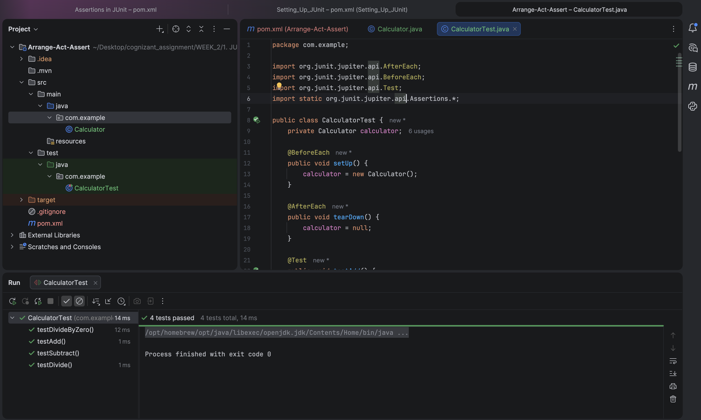

# JUnit Arrange-Act-Assert (AAA) Pattern Testing

A Java project demonstrating the **Arrange-Act-Assert (AAA)** testing structural pattern using **JUnit 5 (Jupiter)**.

---

## 🎯 Objective
- Understand JUnit 5 `@BeforeEach` and `@AfterEach` lifecycle annotations.
- Implement arithmetic functions (add, subtract, divide) with basic error assertions (such as throwing an `ArithmeticException` on division by zero).
- Structure unit tests cleanly using the AAA pattern:
  - **Arrange:** Set up preconditions, dependencies, and test inputs.
  - **Act:** Execute the target method or logic to obtain a result.
  - **Assert:** Validate that the actual results match the expected output.

---

## 📂 File Directory Structure
- [Calculator.java](src/main/java/com/example/Calculator.java) - Core calculator logic (add, subtract, divide).
- [CalculatorTest.java](src/test/java/com/example/CalculatorTest.java) - JUnit 5 test suite with setup/teardown methods.
- `pom.xml` - Maven properties containing JUnit 5 dependencies.

---

## ⚙️ Implementation Details

### Calculator Core Logic (`src/main/java/com/example/Calculator.java`)
```java
package com.example;

public class Calculator {
    public int add(int a, int b) {
        return a + b;
    }

    public int subtract(int a, int b) {
        return a - b;
    }

    public double divide(double a, double b) {
        if (b == 0) {
            throw new ArithmeticException("Division by zero");
        }
        return a / b;
    }
}
```

### Calculator Test Class (`src/test/java/com/example/CalculatorTest.java`)
```java
package com.example;

import org.junit.jupiter.api.AfterEach;
import org.junit.jupiter.api.BeforeEach;
import org.junit.jupiter.api.Test;
import static org.junit.jupiter.api.Assertions.*;

public class CalculatorTest {
    private Calculator calculator;

    @BeforeEach
    public void setUp() {
        calculator = new Calculator();
    }

    @AfterEach
    public void tearDown() {
        calculator = null;
    }

    @Test
    public void testAdd() {
        // Arrange
        int a = 5;
        int b = 3;
        int expected = 8;

        // Act
        int result = calculator.add(a, b);

        // Assert
        assertEquals(expected, result, "Adding " + a + " and " + b + " should equal " + expected);
    }
}
```

---

## 🏃 Execution Details
To execute the tests using Maven, run:
```bash
mvn clean test
```

---

## 📸 Output Verification
The compiler runs and performs all assertions including validation of arithmetic exceptions:


