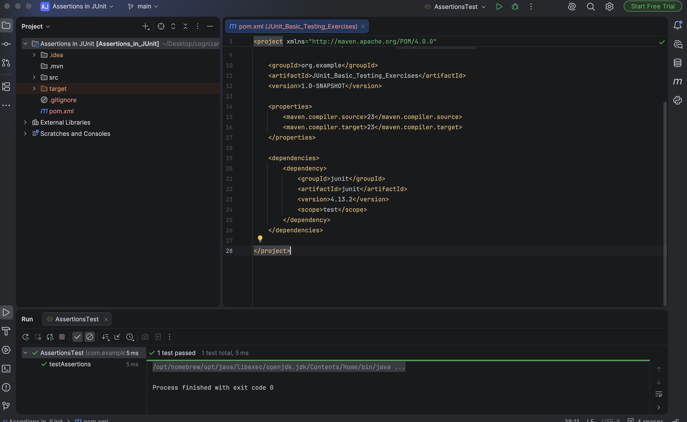

# Assertions in JUnit

A Java testing project designed to demonstrate the usage of standard assertion helper methods provided by **JUnit**.

---

## 🎯 Objective
- Understand how to structure test validation statements using JUnit assertions.
- Explore various assertion APIs, including:
  - `assertEquals(expected, actual)` - Compares values for equality.
  - `assertTrue(condition)` - Assures a boolean condition is true.
  - `assertFalse(condition)` - Assures a boolean condition is false.
  - `assertNull(object)` - Validates that an object reference is null.
  - `assertNotNull(object)` - Validates that an object reference is not null.

---

## 📂 File Directory Structure
- [AssertionsTest.java](src/test/java/com/example/AssertionsTest.java) - Core unit test file mapping assertion expressions.
- `pom.xml` - Maven project properties.

---

## ⚙️ Implementation Details

### Assertions Test Suite (`src/test/java/com/example/AssertionsTest.java`)
```java
package com.example;

import static org.junit.Assert.*;
import org.junit.Test;

public class AssertionsTest {
    @Test
    public void testAssertions() {
        assertEquals(5, 2 + 3);
        assertTrue(5 > 3);
        assertFalse(5 < 3);
        assertNull(null);
        assertNotNull(new Object());
    }
}
```

---

## 🏃 Execution Details
To run the assertions test suite via Maven:
```bash
mvn clean test
```

---

## 📸 Output Verification
The Maven compiler executes the assertions suite and completes successfully:


