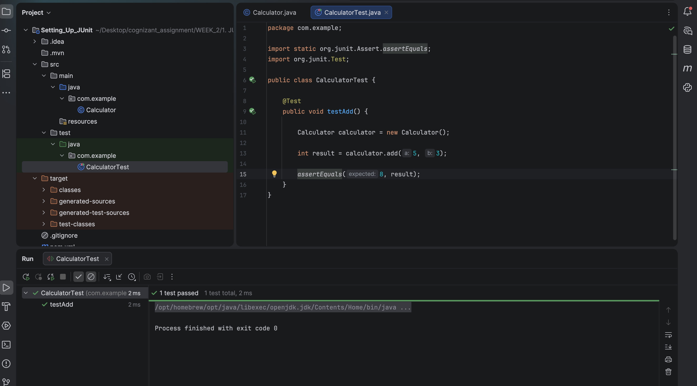

# Setting Up JUnit Testing

A basic Java project to demonstrate setting up and configuring the **JUnit** testing framework inside a Maven environment.

---

## 🎯 Objective
- Configure Maven dependencies for the JUnit library.
- Implement a simple logic utility class ([Calculator](src/main/java/com/example/Calculator.java)).
- Write and execute standard unit test suites using the `@Test` and `assertEquals` APIs.

---

## 📂 File Directory Structure
- [Calculator.java](src/main/java/com/example/Calculator.java) - Core calculator logic.
- [CalculatorTest.java](src/test/java/com/example/CalculatorTest.java) - JUnit test suite.
- `pom.xml` - Maven project configurations and dependency managers.

---

## ⚙️ Implementation Details

### Calculator Core Logic (`src/main/java/com/example/Calculator.java`)
```java
package com.example;

public class Calculator {
    public int add(int a, int b) {
        return a + b;
    }
}
```

### Calculator Test Class (`src/test/java/com/example/CalculatorTest.java`)
```java
package com.example;

import static org.junit.Assert.assertEquals;
import org.junit.Test;

public class CalculatorTest {
    @Test
    public void testAdd() {
        Calculator calculator = new Calculator();
        int result = calculator.add(5, 3);
        assertEquals(8, result);
    }
}
```

---

## 🏃 Execution Details
To build the project and execute the JUnit tests, run the following Maven command in this directory:
```bash
mvn clean test
```

---

## 📸 Output Verification
The unit tests complete successfully, outputting compiler logging and test assertions:


