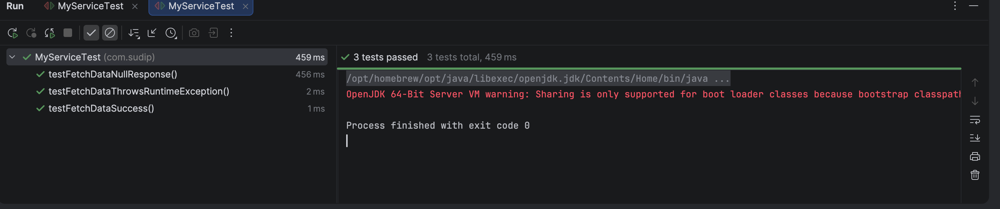

# Mockito Mocking and Stubbing

A Java unit testing project demonstrating the usage of **Mockito** to mock interface dependencies and stub custom responses.

---

## 🎯 Objective
- Understand how to mock interface dependencies using Mockito's `@Mock` annotation.
- Implement stubbing behavior using Mockito's `when(...).thenReturn(...)` and `when(...).thenThrow(...)` APIs.
- Write tests that validate successful calls, null responses, and runtime exception propagation.

---

## 📂 File Directory Structure
- [ExternalApi.java](src/main/java/com/sudip/ExternalApi.java) - Dependency interface.
- [MyService.java](src/main/java/com/sudip/MyService.java) - Core service that consumes `ExternalApi`.
- [MyServiceTest.java](src/test/java/com/sudip/MyServiceTest.java) - Mockito unit test class using the `MockitoExtension` runner.
- `pom.xml` - Maven configurations containing Mockito and JUnit 5 dependencies.

---

## ⚙️ Implementation Details

### External API Interface (`src/main/java/com/sudip/ExternalApi.java`)
```java
package com.sudip;

public interface ExternalApi {
    String getData();
}
```

### Mocking and Stubbing Test Class (`src/test/java/com/sudip/MyServiceTest.java`)
```java
package com.sudip;

import org.junit.jupiter.api.BeforeEach;
import org.junit.jupiter.api.Test;
import org.junit.jupiter.api.extension.ExtendWith;
import org.mockito.Mock;
import org.mockito.junit.jupiter.MockitoExtension;
import static org.junit.jupiter.api.Assertions.*;
import static org.mockito.Mockito.*;

@ExtendWith(MockitoExtension.class)
public class MyServiceTest {

    @Mock
    private ExternalApi mockApi;

    private MyService service;

    @BeforeEach
    public void setUp() {
        service = new MyService(mockApi);
    }

    @Test
    public void testFetchDataSuccess() {
        // Arrange
        when(mockApi.getData()).thenReturn("Mock Data");

        // Act
        String result = service.fetchData();

        // Assert
        assertEquals("Mock Data", result, "Should return mocked data");
        verify(mockApi, times(1)).getData();
    }
}
```

---

## 🏃 Execution Details
To build the project and execute the Mockito unit tests, run:
```bash
mvn clean test
```

---

## 📸 Output Verification
The unit tests complete successfully, indicating all stubbing assertions and exception rules pass:


