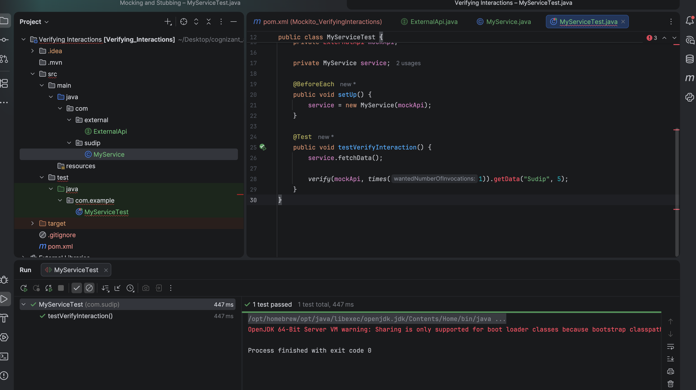

# Mockito Verifying Interactions

A Java unit testing project demonstrating the usage of **Mockito** to verify interactions with dependencies (such as checking whether specific methods were called, how many times, and with what exact parameters).

---

## 🎯 Objective
- Learn how to verify mock interaction behaviors using Mockito's `verify` API.
- Validate that the target service ([MyService](src/main/java/com/sudip/MyService.java)) properly invokes downstream methods with correct parameter values (e.g., calling `mockApi.getData("Sudip", 5)` exactly 1 time).

---

## 📂 File Directory Structure
- [ExternalApi.java](src/main/java/com/external/ExternalApi.java) - Dependency interface.
- [MyService.java](src/main/java/com/sudip/MyService.java) - Core service invoking `ExternalApi`.
- [MyServiceTest.java](src/test/java/com/example/MyServiceTest.java) - Mockito unit test class using the `MockitoExtension` runner.
- `pom.xml` - Maven configurations containing Mockito and JUnit 5 dependencies.

---

## ⚙️ Implementation Details

### External API Interface (`src/main/java/com/external/ExternalApi.java`)
```java
package com.sudip;

public interface ExternalApi {
    void getData(String id, int count);
}
```

### Verifying Interactions Test Class (`src/test/java/com/example/MyServiceTest.java`)
```java
package com.sudip;

import org.junit.jupiter.api.BeforeEach;
import org.junit.jupiter.api.Test;
import org.junit.jupiter.api.extension.ExtendWith;
import org.mockito.Mock;
import org.mockito.junit.jupiter.MockitoExtension;
import static org.mockito.Mockito.*;

@ExtendWith(MockitoExtension.class)
public class MyServiceTest {

    @Mock
    private ExternalApi mockApi;

    private MyService service;

    @BeforeEach
    public void setUp() {
        service = new MyService(mockApi);
    }

    @Test
    public void testVerifyInteraction() {
        // Act
        service.fetchData();

        // Assert (Verify mock dependency interaction)
        verify(mockApi, times(1)).getData("Sudip", 5);
    }
}
```

---

## 🏃 Execution Details
To run the Maven unit tests:
```bash
mvn clean test
```

---

## 📸 Output Verification
The unit tests complete successfully, indicating all interaction rules and verify queries match:


