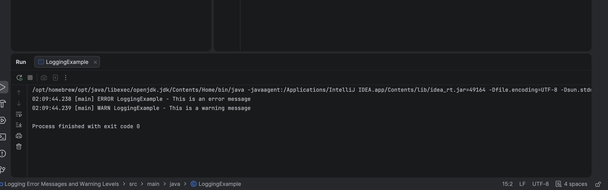

# SLF4J Logging and Error Levels

A Java console application demonstrating how to integrate the **SLF4J (Simple Logging Facade for Java)** framework to record diagnostic logging across various levels (Error, Warning, etc.).

---

## 🎯 Objective
- Configure SLF4J API and simple logger dependencies in a Maven project.
- Implement SLF4J logger instances using `LoggerFactory.getLogger(...)`.
- Log diagnostic messages using appropriate severity levels:
  - `logger.error("error message")`
  - `logger.warn("warning message")`

---

## 📂 File Directory Structure
- [LoggingExample.java](src/main/java/LoggingExample.java) - Entrypoint Java class executing logging expressions.
- `pom.xml` - Maven configurations setting up SLF4J dependencies (`slf4j-api` and `slf4j-simple`).

---

## ⚙️ Implementation Details

### Logging Example Class (`src/main/java/LoggingExample.java`)
```java
import org.slf4j.Logger;
import org.slf4j.LoggerFactory;

public class LoggingExample {

    private static final Logger logger = LoggerFactory.getLogger(LoggingExample.class);

    public static void main(String[] args) {
        logger.error("This is an error message");
        logger.warn("This is a warning message");
    }
}
```

---

## 🏃 Execution Details
To build and execute the logging application using Maven:
1. Compile the project:
   ```bash
   mvn clean compile
   ```
2. Run the main class:
   ```bash
   mvn exec:java -Dexec.mainClass="LoggingExample"
   ```

---

## 📸 Output Verification
The application logs output onto the terminal with the designated severity flags and namespaces:


