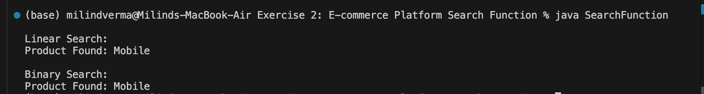

# E-commerce Platform Search Function

An algorithmic Java application showcasing search algorithms by implementing **Linear Search** and **Binary Search** algorithms to look up products in an inventory list.

---

## 🎯 Objective
- Analyze differences between searching algorithms.
- Implement **Linear Search** with a time complexity of `O(n)`.
- Implement **Binary Search** with a time complexity of `O(log n)` (requiring pre-sorted arrays).
- Analyze performance comparison and search correctness.

---

## 📂 File Directory Structure
- [Product.java](Product.java) - Product data model class.
- [SearchFunction.java](SearchFunction.java) - Core search algorithms (linear, binary) and execution entrypoint.

---

## ⚙️ Implementation Details

### Linear Search Logic
```java
public static Product linearSearch(Product[] products, int id) {
    for (Product product : products) {
        if (product.productId == id) {
            return product;
        }
    }
    return null;
}
```

### Binary Search Logic
```java
public static Product binarySearch(Product[] products, int id) {
    int left = 0;
    int right = products.length - 1;

    while (left <= right) {
        int mid = (left + right) / 2;
        if (products[mid].productId == id) {
            return products[mid];
        }
        if (products[mid].productId < id) {
            left = mid + 1;
        } else {
            right = mid - 1;
        }
    }
    return null;
}
```

---

## 🏃 Execution Details
To compile and execute the search utility:
1. Compile the java source files:
   ```bash
   javac Product.java SearchFunction.java
   ```
2. Run the main class:
   ```bash
   java SearchFunction
   ```

---

## 📸 Output Verification
The program correctly processes the linear search on unsorted data and binary search after applying sorting controls:


