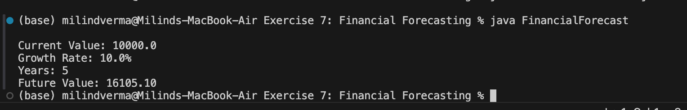

# Financial Forecasting

An algorithmic Java application that implements a **recursive** algorithm to forecast future financial values based on a compounding annual growth rate (CAGR).

---

## 🎯 Objective
- Implement recursion to solve compounding math problems.
- Design base cases and recursive calls to compute future value over a set number of years.
- Analyze the performance complexity of recursion:
  - **Time Complexity:** `O(N)` where `N` is the number of years.
  - **Space Complexity:** `O(N)` due to recursive call stack storage.

---

## 📂 File Directory Structure
- [FinancialForecast.java](FinancialForecast.java) - Implementation logic and execution entrypoint.

---

## ⚙️ Implementation Details

### Recursive Forecast Method
```java
public static double forecast(double currentValue, double growthRate, int years) {
    // Base Case: no more compounding years left
    if (years == 0) {
        return currentValue;
    }
    // Recursive Call: compound value and decrement year counter
    return forecast(currentValue * (1 + growthRate), growthRate, years - 1);
}
```

---

## 🏃 Execution Details
To compile and execute the forecasting model:
1. Compile the java source file:
   ```bash
   javac FinancialForecast.java
   ```
2. Run the main class:
   ```bash
   java FinancialForecast
   ```

---

## 📸 Output Verification
The program recursively compounds the initial portfolio of `10,000` at a `10.0%` rate for `5` years, calculating the future value successfully:


