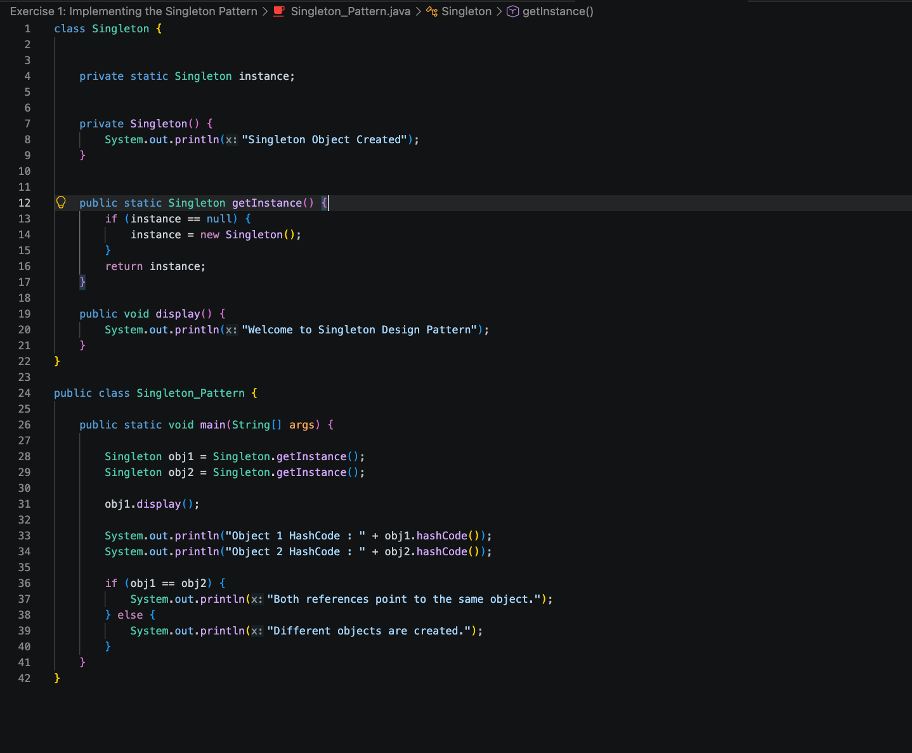
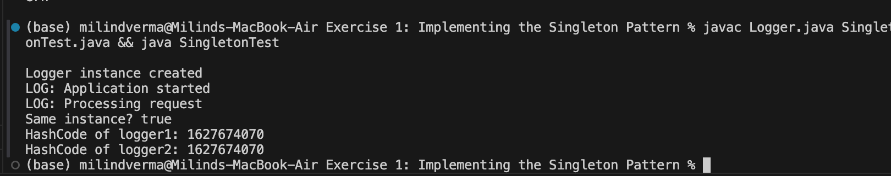

# Singleton Design Pattern

A Java project demonstrating the implementation and validation of the creational **Singleton Pattern** by building a central Logger system.

---

## 🎯 Objective
- Understand creational design patterns.
- Implement the Singleton pattern ensuring:
  - Private constructor to prevent direct instantiation.
  - Private static instance variable holding the single class instance.
  - Public static method (`getInstance()`) providing global access.
- Verify that multiple access requests return the exact same memory instance reference.

---

## 📂 File Directory Structure
- [Logger.java](Logger.java) - Singleton logger implementation class.
- [SingletonTest.java](SingletonTest.java) - Test application verifying instance identity.

---

## ⚙️ Implementation Details

### Singleton Logger (`Logger.java`)
```java
public class Logger {
    private static Logger instance;

    // Private constructor prevents external instantiation
    private Logger() {
        System.out.println("Logger instance created");
    }

    public static Logger getInstance() {
        // Lazy initialization
        if (instance == null) {
            instance = new Logger();
        }
        return instance;
    }

    public void log(String message) {
        System.out.println("LOG: " + message);
    }
}
```

---

## 🏃 Execution Details
To compile and execute the validation suite:
1. Compile files:
   ```bash
   javac Logger.java SingletonTest.java
   ```
2. Run test:
   ```bash
   java SingletonTest
   ```

---

## 📸 Output Verification
The test prints unique hash codes indicating both logger variables refer to the exact same instance:

### 1. Code Class Structures


### 2. Execution Output Log

