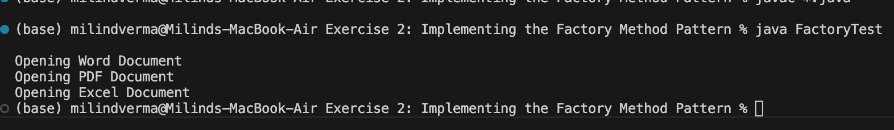

# Factory Method Design Pattern

A Java project demonstrating the implementation of the creational **Factory Method Pattern** by building a document processing library.

---

## 🎯 Objective
- Understand creational design patterns.
- Decouple the client code from concrete class initialization.
- Implement the Factory Method pattern:
  - Define a common product interface (`Document`).
  - Create concrete products (`WordDocument`, `PdfDocument`, `ExcelDocument`).
  - Declare a creator abstract class (`DocumentFactory`) defining a factory method.
  - Implement concrete factories (`WordFactory`, `PdfFactory`, `ExcelFactory`) generating concrete documents.

---

## 📂 File Directory Structure
- [Document.java](Document.java) - Common interface defining `open()` behaviour.
- **Concrete Documents:** [WordDocument.java](WordDocument.java), [PdfDocument.java](PdfDocument.java), [ExcelDocument.java](ExcelDocument.java).
- [DocumentFactory.java](DocumentFactory.java) - Creator abstract class declaring `createDocument()`.
- **Concrete Factories:** [WordFactory.java](WordFactory.java), [PdfFactory.java](PdfFactory.java), [ExcelFactory.java](ExcelFactory.java).
- [FactoryTest.java](FactoryTest.java) - Client test runner verifying factory selection.

---

## ⚙️ Implementation Details

### Document Interface (`Document.java`)
```java
public interface Document {
    void open();
}
```

### Document Factory Creator (`DocumentFactory.java`)
```java
public abstract class DocumentFactory {
    public abstract Document createDocument();
}
```

### Excel Factory Concrete Creator (`ExcelFactory.java`)
```java
public class ExcelFactory extends DocumentFactory {
    @Override
    public Document createDocument() {
        return new ExcelDocument();
    }
}
```

---

## 🏃 Execution Details
To compile and execute the test runner:
1. Compile files:
   ```bash
   javac *.java
   ```
2. Run test:
   ```bash
   java FactoryTest
   ```

---

## 📸 Output Verification
The program dynamically resolves factories to generate corresponding documents and calls their overridden interfaces successfully:


