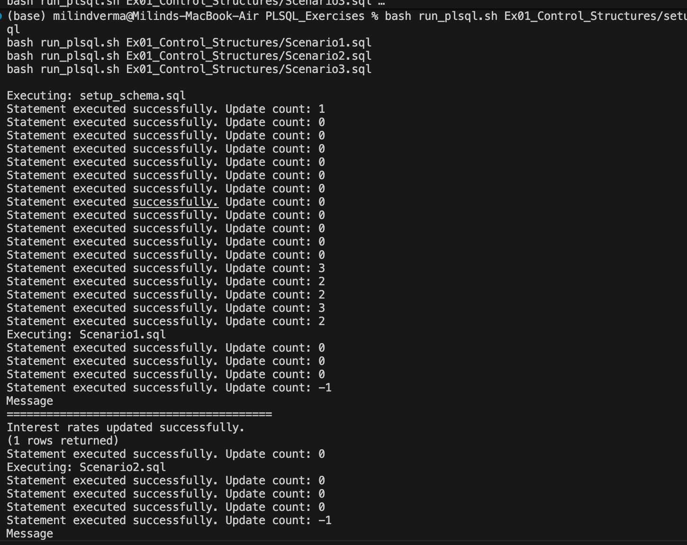
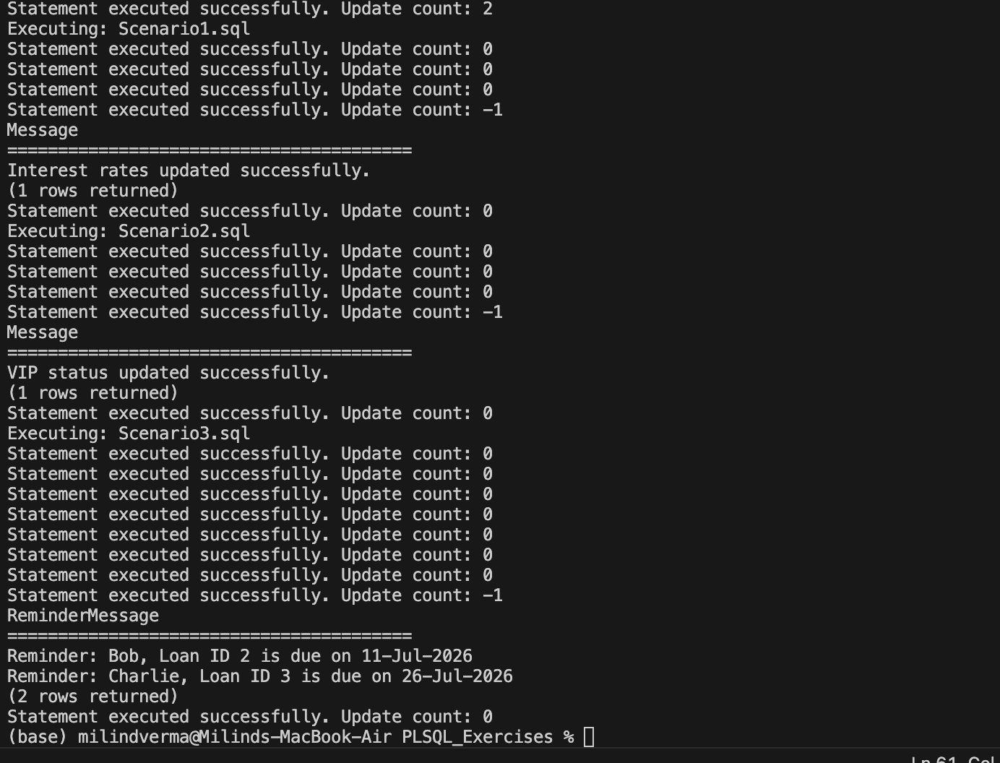

# PL/SQL Control Structures (MySQL Simulation)

Database scripts implementing stored procedures, cursors, loops, and transaction controls to execute batch banking operations.

---

## 🎯 Objective
- Simulate PL/SQL procedural control structures in SQL.
- Implement conditional cursor loops to traverse record sets.
- Execute business update operations within safe transactions (`START TRANSACTION`, `COMMIT`, `ROLLBACK`).

---

## 📂 File Directory Structure
- [setup_schema.sql](setup_schema.sql) - Database schema configuration, table relations, and seed mock data.
- [Scenario1.sql](Scenario1.sql) - Procedure updating interest rates for senior citizen customers (over 60) by applying a 1% discount.
- [Scenario2.sql](Scenario2.sql) - Procedure evaluating customer balance and assigning VIP flags.
- [Scenario3.sql](Scenario3.sql) - Procedure notifying/generating warnings for loan entries approaching expiration dates.

---

## ⚙️ SQL Implementation Details

### Scenario 1 Procedure (`Scenario1.sql`)
```sql
CREATE PROCEDURE RunScenario1()
BEGIN
    DECLARE v_done INT DEFAULT FALSE;
    DECLARE v_loan_id INT;
    DECLARE v_interest_rate DECIMAL(5,2);
    
    DECLARE cur CURSOR FOR 
        SELECT l.LoanID, l.InterestRate
        FROM Loans l
        JOIN Customers c ON l.CustomerID = c.CustomerID
        WHERE TIMESTAMPDIFF(YEAR, c.DOB, CURDATE()) > 60;
        
    DECLARE CONTINUE HANDLER FOR NOT FOUND SET v_done = TRUE;
    
    START TRANSACTION;
    OPEN cur;
    
    read_loop: LOOP
        FETCH cur INTO v_loan_id, v_interest_rate;
        IF v_done THEN
            LEAVE read_loop;
        END IF;
        
        UPDATE Loans
        SET InterestRate = v_interest_rate - 1
        WHERE LoanID = v_loan_id;
    END LOOP;
    
    CLOSE cur;
    COMMIT;
    
    SELECT 'Interest rates updated successfully.' AS Message;
END
```

---

## 🏃 Execution Details
To execute the SQL scenarios:
1. Initialize the database schema:
   ```bash
   mysql -u root -p < setup_schema.sql
   ```
2. Execute the scenario procedure:
   ```bash
   mysql -u root -p < Scenario1.sql
   ```
*(Alternatively, execute scripts using the parent Java runner utility).*

---

## 📸 Output Verification
The queries execute successfully, applying transactional updates:

### 1. Database Schema Configurations


### 2. Transaction Execution Output

