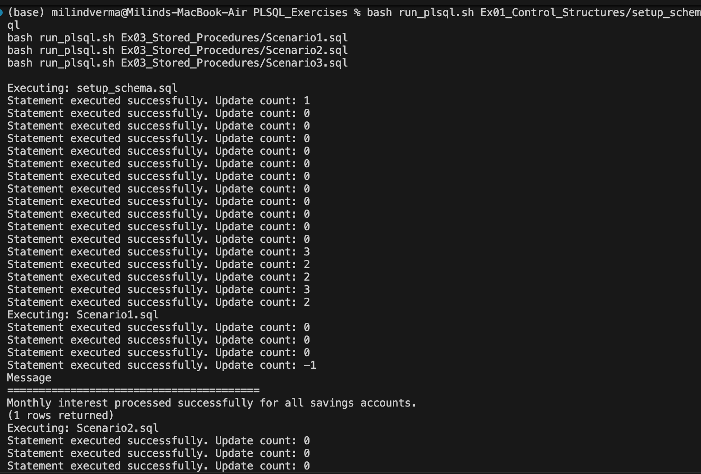
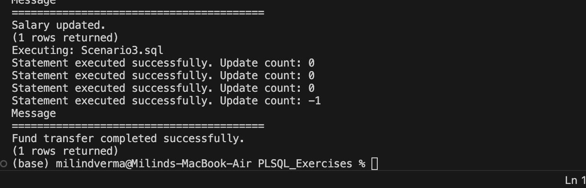

# PL/SQL Stored Procedures (MySQL Simulation)

Database scripts implementing stored procedures for core banking operations, using cursors, transaction boundaries, and handlers to ensure transactional safety.

---

## 🎯 Objective
- Simulate PL/SQL stored procedures inside SQL databases.
- Handle transactional safety bounds (`SQLEXCEPTION` handlers that trigger `ROLLBACK`).
- Perform multiple operations inside a single logical unit of work (e.g., Transferring funds between two separate accounts).

---

## 📂 File Directory Structure
- [Scenario1.sql](Scenario1.sql) - Procedure updating savings account balances with a 1% monthly interest.
- [Scenario2.sql](Scenario2.sql) - Procedure giving salary bonuses to employees of a designated department.
- [Scenario3.sql](Scenario3.sql) - Procedure transferring funds between accounts with checks for balance limits.

---

## ⚙️ SQL Implementation Details

### Transfer Funds Stored Procedure (`Scenario3.sql`)
```sql
CREATE PROCEDURE TransferFunds(
    IN p_from_account INT,
    IN p_to_account INT,
    IN p_amount DECIMAL(15,2)
)
BEGIN
    DECLARE v_balance DECIMAL(15,2);
    
    DECLARE EXIT HANDLER FOR SQLEXCEPTION
    BEGIN
        ROLLBACK;
        SELECT 'Transaction failed. Rolled back.' AS Message;
    END;

    START TRANSACTION;

    SELECT Balance INTO v_balance FROM Accounts WHERE AccountID = p_from_account;
    
    IF v_balance IS NULL THEN
        ROLLBACK;
        SELECT 'Error: Source account does not exist.' AS Message;
    ELSEIF v_balance < p_amount THEN
        ROLLBACK;
        SELECT 'Error: Insufficient balance.' AS Message;
    ELSE
        UPDATE Accounts
        SET Balance = Balance - p_amount
        WHERE AccountID = p_from_account;

        UPDATE Accounts
        SET Balance = Balance + p_amount
        WHERE AccountID = p_to_account;

        COMMIT;
        SELECT 'Fund transfer completed successfully.' AS Message;
    END IF;
END
```

---

## 🏃 Execution Details
To execute the stored procedures:
1. Ensure the schema is configured (`setup_schema.sql` inside `Ex01_Control_Structures` directory).
2. Execute the procedure files directly:
   ```bash
   mysql -u root -p < Scenario3.sql
   ```

---

## 📸 Output Verification
The procedures compound interest, give bonuses, and transfer funds transactionally:

### 1. Interest Compounding Output


### 2. Fund Transfer Status

