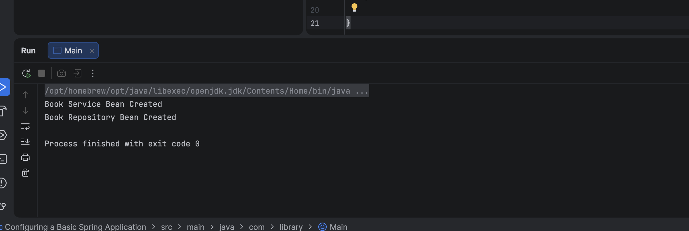

# Configuring a Basic Spring Application

A foundational Spring framework application that configures and initializes a **ClassPathXmlApplicationContext** container to load, configure, and wire custom beans.

---

## 🎯 Objective
- Create separate bean components under modular packages (`com.library.repository`, `com.library.service`).
- Write an XML-based metadata registry to register repository and service beans.
- Load the configuration context to verify that Spring properly initializes the container and executes operations.

---

## 📂 File Directory Structure
- [BookRepository.java](src/main/java/com/repository/BookRepository.java) - Repository class.
- [BookService.java](src/main/java/com/service/BookService.java) - Service class consuming the repository.
- [Main.java](src/main/java/com/library/Main.java) - Core launcher initializing the Spring application context.
- [applicationContext.xml](src/main/resources/applicationContext.xml) - Spring XML bean registry.
- `pom.xml` - Maven properties.

---

## ⚙️ Spring XML Metadata Configuration (`src/main/resources/applicationContext.xml`)
```xml
<?xml version="1.0" encoding="UTF-8"?>
<beans xmlns="http://www.springframework.org/schema/beans"
       xmlns:xsi="http://www.w3.org/2001/XMLSchema-instance"
       xsi:schemaLocation="
       http://www.springframework.org/schema/beans
       https://www.springframework.org/schema/beans/spring-beans.xsd">

    <bean id="bookRepository" class="com.library.repository.BookRepository"/>

    <bean id="bookService" class="com.library.service.BookService">
        <property name="repository" ref="bookRepository"/>
    </bean>

</beans>
```

---

## 🏃 Execution Details
To execute the application loader using Maven:
```bash
mvn clean compile exec:java -Dexec.mainClass="com.library.Main"
```

---

## 📸 Output Verification
The Spring framework instantiates the beans, applies dependency properties, and prints confirmation messages:


