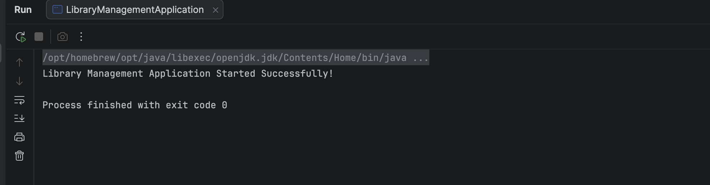

# Creating and Configuring a Maven Project

A Java project demonstrating the initial setup and structure of a **Maven** build environment, implementing standard compiler settings and executing a baseline Java entrypoint class.

---

## 🎯 Objective
- Set up a standard Maven directory structure (`src/main/java`).
- Configure a `pom.xml` build manifest with compiler properties.
- Implement and verify a baseline application launcher class ([LibraryManagementApplication](src/main/java/com/library/LibraryManagementApplication.java)).

---

## 📂 File Directory Structure
- [LibraryManagementApplication.java](src/main/java/com/library/LibraryManagementApplication.java) - Application execution entrypoint.
- `pom.xml` - Maven project configurations.

---

## ⚙️ Implementation Details

### Application Launcher Class (`src/main/java/com/library/LibraryManagementApplication.java`)
```java
package com.library;

public class LibraryManagementApplication {
    public static void main(String[] args) {
        System.out.println("Library Management Application Started Successfully!");
    }
}
```

---

## 🏃 Execution Details
To compile and execute the Maven project:
1. Clean and compile the application:
   ```bash
   mvn clean compile
   ```
2. Execute the launcher via the Maven Exec plugin:
   ```bash
   mvn exec:java -Dexec.mainClass="com.library.LibraryManagementApplication"
   ```

---

## 📸 Output Verification
The project builds and outputs logs confirming successful execution of the main class:


