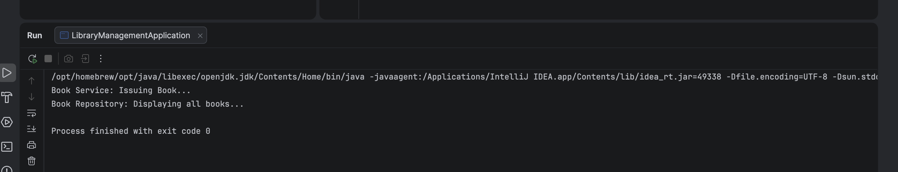

# Implementing Dependency Injection

A Spring Core Java project showcasing bean creation, wireframes, and **Setter Dependency Injection** using XML-based configuration context.

---

## 🎯 Objective
- Create Spring Core service ([BookService](src/main/java/com/library/BookService.java)) and repository ([BookRepository](src/main/java/com/library/BookRepository.java)) components.
- Configure dependency relationships in an XML bean configuration ([applicationContext.xml](src/main/resources/applicationContext.xml)).
- Inject `BookRepository` into `BookService` using Setter Injection (`<property name="..." ref="..."/>`).
- Load the Spring container using `ClassPathXmlApplicationContext` and call bean execution.

---

## 📂 File Directory Structure
- [BookRepository.java](src/main/java/com/library/BookRepository.java) - Book repository mock database accessor.
- [BookService.java](src/main/java/com/library/BookService.java) - Book service implementing dependencies.
- [applicationContext.xml](src/main/resources/applicationContext.xml) - Spring XML bean registry layout.
- [LibraryManagementApplication.java](src/main/java/com/library/LibraryManagementApplication.java) - Application bootstrap loading Spring Context.
- `pom.xml` - Maven project configurations.

---

## ⚙️ Spring Bean Configuration (`src/main/resources/applicationContext.xml`)
```xml
<?xml version="1.0" encoding="UTF-8"?>
<beans xmlns="http://www.springframework.org/schema/beans"
       xmlns:xsi="http://www.w3.org/2001/XMLSchema-instance"
       xsi:schemaLocation="
       http://www.springframework.org/schema/beans
       https://www.springframework.org/schema/beans/spring-beans.xsd">

    <!-- Book Repository Bean -->
    <bean id="bookRepository" class="com.library.BookRepository"/>

    <!-- Book Service Bean with Setter Injection -->
    <bean id="bookService" class="com.library.BookService">
        <property name="bookRepository" ref="bookRepository"/>
    </bean>

</beans>
```

---

## 🏃 Execution Details
To execute the application context loader:
1. Compile and run main class:
   ```bash
   mvn clean compile exec:java -Dexec.mainClass="com.library.LibraryManagementApplication"
   ```

---

## 📸 Output Verification
The Spring application context initializes successfully, wires the beans, and processes the service method:


