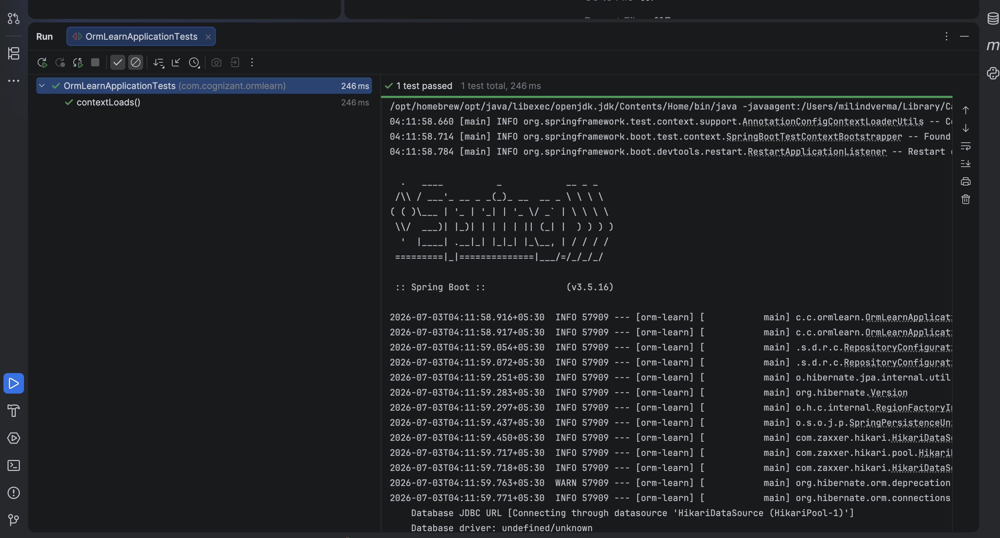

# Spring Data JPA Quick Example

A Spring Boot CommandLine application demonstrating the basic CRUD database operations using **Spring Data JPA** repositories against a relational schema.

---

## 🎯 Objective
- Connect a Spring Boot application to a relational database using JDBC.
- Map relational tables to Java models using JPA annotations (`@Entity`, `@Table`, `@Id`, `@Column`).
- Define repository abstractions extending `JpaRepository` to perform CRUD transactions automatically.
- Implement transactional operations inside a custom service layer.

---

## 📂 File Directory Structure
- [OrmLearnApplication.java](orm-learn/Quick%20Example/src/main/java/com/cognizant/ormlearn/OrmLearnApplication.java) - Application execution entrypoint loading database commands.
- [Country.java](orm-learn/Quick%20Example/src/main/java/com/cognizant/model/Country.java) - JPA Entity mapping the `country` table.
- [CountryRepository.java](orm-learn/Quick%20Example/src/main/java/com/cognizant/repository/CountryRepository.java) - JPA Repository interface.
- [CountryService.java](orm-learn/Quick%20Example/src/main/java/com/cognizant/service/CountryService.java) - Service layer wrapping transactional operations.
- [CountryNotFoundException.java](orm-learn/Quick%20Example/src/main/java/com/cognizant/exception/CountryNotFoundException.java) - Entity look-up fallback exception.
- `application.properties` - Database connection credentials, dialect, and logging levels.

---

## ⚙️ Core Configuration Details

### Country Entity (`src/main/java/com/cognizant/model/Country.java`)
```java
package com.cognizant.model;

import jakarta.persistence.*;

@Entity
@Table(name = "country")
public class Country {
    @Id
    @Column(name = "co_code")
    private String code;

    @Column(name = "co_name")
    private String name;

    // Constructors, Getters, Setters, toString()
}
```

### Country Repository (`src/main/java/com/cognizant/repository/CountryRepository.java`)
```java
package com.cognizant.repository;

import com.cognizant.model.Country;
import org.springframework.data.jpa.repository.JpaRepository;
import org.springframework.stereotype.Repository;

@Repository
public interface CountryRepository extends JpaRepository<Country, String> {
}
```

---

## 🏃 Execution Details
To execute the database migrations and query runs:
1. Ensure a local database server is running with target schemas.
2. Run the Spring Boot application using Maven:
   ```bash
   mvn clean spring-boot:run
   ```

---

## 📸 Output Verification
The Spring Boot logger boots up, establishes connection pools, and performs transactional inserts, selections, updates, and deletes:


