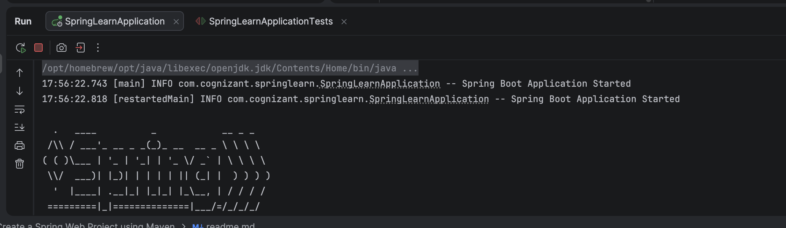
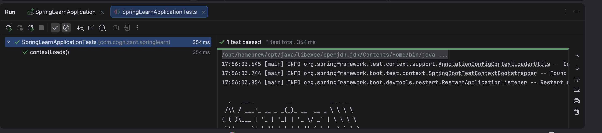
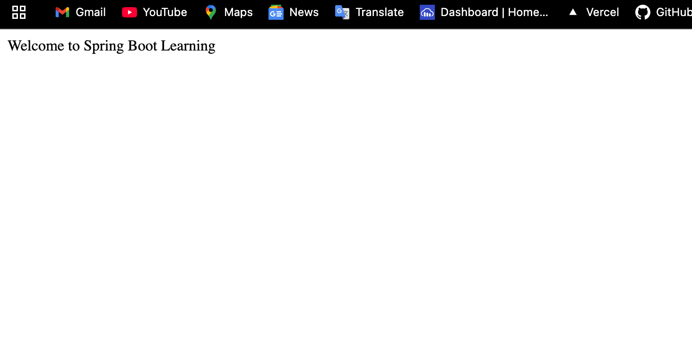

## Spring Learn - Spring Boot Web Application

A simple Spring Boot application developed using **Spring Initializr** and **Maven** to demonstrate the fundamentals of Spring Boot, XML Bean Configuration, Logging, Dependency Injection, and REST APIs.

> **Assignment:** Cognizant Spring Boot Hands-on Lab

---

## 📌 Objectives

This project demonstrates:

- Spring Boot Application Creation
- Spring Initializr
- `@SpringBootApplication`
- `SpringApplication.run()`
- Embedded Tomcat Server
- XML Bean Configuration
- Spring IoC Container
- Constructor and Setter Injection
- Logging using SLF4J
- REST API Development
- Maven Build Tool

---

## 🛠️ Technologies Used

| Technology | Version |
|------------|----------|
| Java | 23 |
| Spring Boot | 3.x |
| Maven | 3.9.x |
| Spring Web | Latest |
| Spring Context | Latest |
| Spring Boot DevTools | Latest |
| IntelliJ IDEA | Community Edition |
| Git & GitHub | Latest |

---

## 📁 Project Structure

```text
spring-learn
│
├── src
│   ├── main
│   │   ├── java
│   │   │   └── com.cognizant
│   │   │       ├── controller
│   │   │       │    └── HomeController.java
│   │   │       ├── model
│   │   │       │    └── Employee.java
│   │   │       └── springlearn
│   │   │            └── SpringLearnApplication.java
│   │   │
│   │   └── resources
│   │       ├── application.properties
│   │       └── employee.xml
│   │
│   └── test
│       └── java
│
├── screenshots
│
├── pom.xml
│
└── README.md
```

---

## ⚙️ Features

- ✅ Spring Boot Application
- ✅ Embedded Apache Tomcat
- ✅ XML Bean Loading
- ✅ Spring IoC Container
- ✅ Dependency Injection
- ✅ Logging
- ✅ REST Controller
- ✅ Maven Project
- ✅ JUnit Test Support

---

## 🚀 REST Endpoints

### Home Page

```
GET /
```

Output

```
Welcome to Spring Boot Learning
```

---

### Hello Endpoint

```
GET /hello
```

Output

```
Hello Milind!
```

---

## ⚙️ Configuration

### application.properties

```properties
server.port=8081

logging.level.root=INFO

logging.level.com.cognizant=DEBUG

logging.pattern.console=%d{yyyy-MM-dd HH:mm:ss} - %msg%n
```

---

## 📦 XML Bean Configuration

The project demonstrates XML-based bean configuration using:

- `<bean>`
- `<property>`
- Spring IoC Container
- `ClassPathXmlApplicationContext`

Example:

```xml
<bean id="employee"
      class="com.cognizant.model.Employee">

    <property name="id" value="101"/>
    <property name="name" value="Milind Verma"/>

</bean>
```

---

## ▶️ How to Run

### Clone Repository

```bash
git clone https://github.com/yourusername/spring-learn.git
```

---

### Move to Project

```bash
cd spring-learn
```

---

### Build Project

```bash
mvn clean install
```

---

### Run Project

```bash
mvn spring-boot:run
```

---

### Open Browser

```
http://localhost:8081/
```

---

## 📸 Output Screenshots





## 📚 Concepts Covered

- Spring Boot
- Spring Initializr
- Maven
- Embedded Tomcat
- REST APIs
- Spring IoC Container
- Bean Configuration
- XML Configuration
- Setter Injection
- Constructor Injection
- Logging
- Dependency Injection

---

## 📖 References

- https://start.spring.io/
- https://spring.io/projects/spring-boot
- https://docs.spring.io/spring-framework/reference/
- https://maven.apache.org/

---


## ⭐ If you found this project useful, don't forget to give it a star!