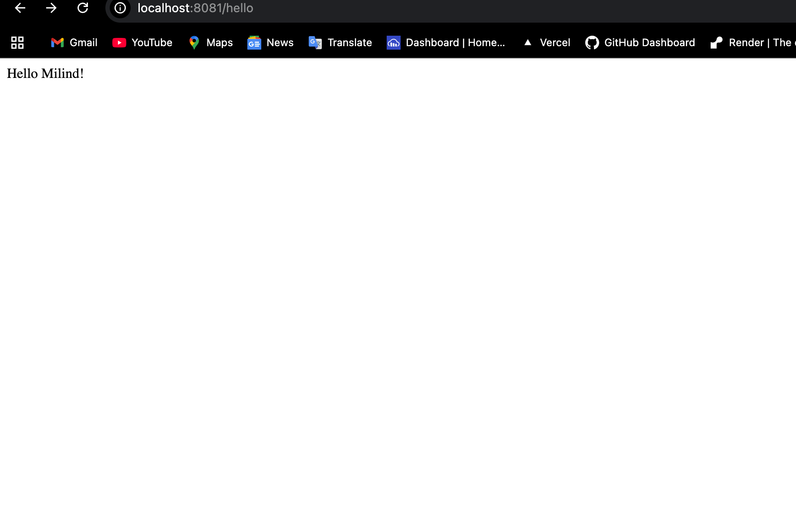
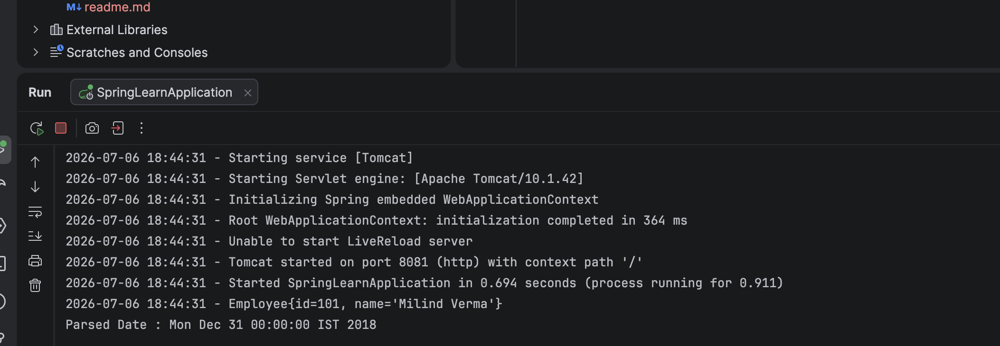

# Spring Core - Load SimpleDateFormat from Spring XML Configuration

## Overview

This project demonstrates how to create and load a `SimpleDateFormat` bean from a Spring XML configuration file using the Spring IoC Container. The application retrieves the bean from the XML configuration, parses a date string, and displays the result in the console.

This project was developed as part of the Spring Core Hands-on Lab.

---

## Technologies Used

- Java 24
- Spring Boot 3.5.3
- Spring Framework 6
- Maven
- Spring Web
- Spring Context
- SLF4J Logging
- IntelliJ IDEA

---

## Project Structure

```text
Spring Core - Load SimpleDateFormat from Spring
│
├── src
│   ├── main
│   │   ├── java
│   │   │   └── com.cognizant
│   │   │       ├── controller
│   │   │       ├── model
│   │   │       └── springlearn
│   │   │
│   │   └── resources
│   │       ├── application.properties
│   │       ├── employee.xml
│   │       └── date-format.xml
│   │
│   └── test
│
├── screenshots
├── pom.xml
└── README.md
```

---

## Features

- Spring Boot application using Maven
- XML-based Bean Configuration
- Spring IoC Container
- Bean Loading using `ClassPathXmlApplicationContext`
- Date Parsing using `SimpleDateFormat`
- Logging with SLF4J
- Embedded Tomcat Server

---

## XML Bean Configuration

The `date-format.xml` file defines a reusable `SimpleDateFormat` bean.

```xml
<bean id="dateFormat" class="java.text.SimpleDateFormat">
    <constructor-arg value="dd/MM/yyyy"/>
</bean>
```

---

## How to Run

Clone the repository:

```bash
git clone https://github.com/your-username/spring-core-date-format.git
```

Navigate to the project directory:

```bash
cd spring-core-date-format
```

Build the project:

```bash
mvn clean install
```

Run the application:

```bash
mvn spring-boot:run
```

---

## Configuration

### application.properties

```properties
server.port=8081

logging.level.root=INFO
logging.level.com.cognizant=DEBUG

logging.pattern.console=%d{yyyy-MM-dd HH:mm:ss} - %msg%n
```

---

## Expected Console Output

```text
Spring Boot Application Started

Employee{id=101, name='Milind Verma'}

Parsed Date : Mon Dec 31 00:00:00 IST 2018
```

---

## Output

### Application Output



### Console Output



---

## Concepts Covered

- Spring Boot
- Spring Core
- Spring IoC Container
- XML Bean Configuration
- Constructor Injection
- ClassPathXmlApplicationContext
- Bean Loading
- SimpleDateFormat
- Logging
- Maven

---

## References

- https://start.spring.io/
- https://docs.spring.io/spring-framework/reference/core.html
- https://spring.io/projects/spring-boot
- https://maven.apache.org/