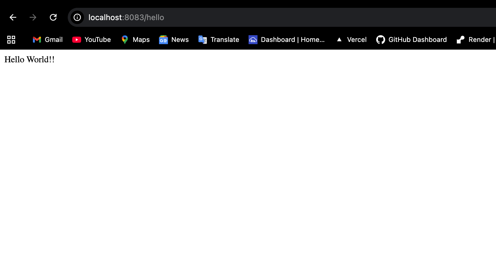
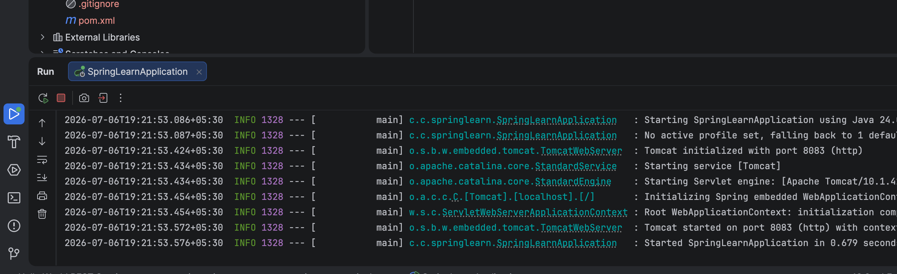
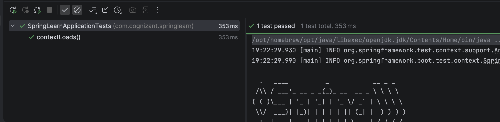

# Spring Learn - Hello World RESTful Web Service

A simple RESTful Web Service built using **Spring Boot** that returns **Hello World!!** using the HTTP GET method.

---

## 📌 Objective

This project demonstrates:

- HTTP Request and Response
- RESTful Web Services
- Spring Boot REST API
- `@RestController`
- `@GetMapping`
- Logging using SLF4J
- Testing using Browser and Postman

---

## 🛠️ Technologies Used

- Java 23
- Spring Boot
- Maven
- Spring Web
- IntelliJ IDEA / Eclipse
- Postman

---

## 📂 Project Structure

```
spring-learn
│
├── src
│   ├── main
│   │   ├── java
│   │   │   └── com
│   │   │       └── cognizant
│   │   │           └── springlearn
│   │   │               ├── SpringLearnApplication.java
│   │   │               └── controller
│   │   │                   └── HelloController.java
│   │   │
│   │   └── resources
│   │       └── application.properties
│   │
│   └── test
│       └── java
│           └── com
│               └── cognizant
│                   └── springlearn
│                       └── SpringLearnApplicationTests.java
│
├── pom.xml
└── README.md
```

---

## 🚀 How to Run

### Clone the Repository

```bash
git clone <repository-url>
```

### Open the Project

Open the project in IntelliJ IDEA or Eclipse.

### Run Using Maven

```bash
mvn spring-boot:run
```

Or run the `SpringLearnApplication.java` file directly from your IDE.

---

## ⚙️ Configuration

**application.properties**

```properties
server.port=8083
```

---

## 🌐 REST API

### Request

```
GET http://localhost:8083/hello
```

### Response

```
Hello World!!
```

---

## 📨 HTTP Request

```http
GET /hello HTTP/1.1
Host: localhost:8083
User-Agent: Mozilla/5.0
Accept: text/plain
```

---

## 📩 HTTP Response

```http
HTTP/1.1 200 OK
Content-Type: text/plain;charset=UTF-8

Hello World!!
```

---

## 📷 Output

### Browser Output



---

### Postman Output



---

### Console Output



---

## 📖 Expected Console Log

```
START
END
```

---

## 📋 Project Features

- REST API using Spring Boot
- Uses `@RestController`
- Uses `@GetMapping`
- Returns plain text response
- Logging with SLF4J
- Browser Testing
- Postman Testing

---

## 📚 Learning Outcomes

- Understand HTTP Request
- Understand HTTP Response
- Learn REST Architecture
- Build REST APIs using Spring Boot
- Learn Request Mapping
- Test APIs using Browser
- Test APIs using Postman

---