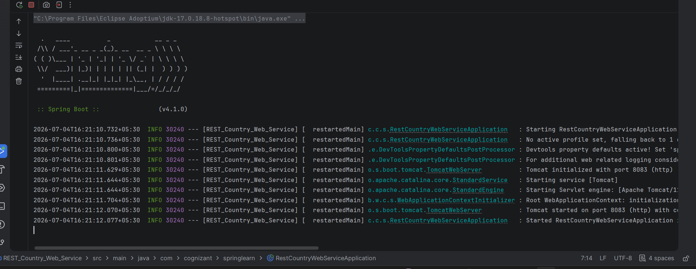
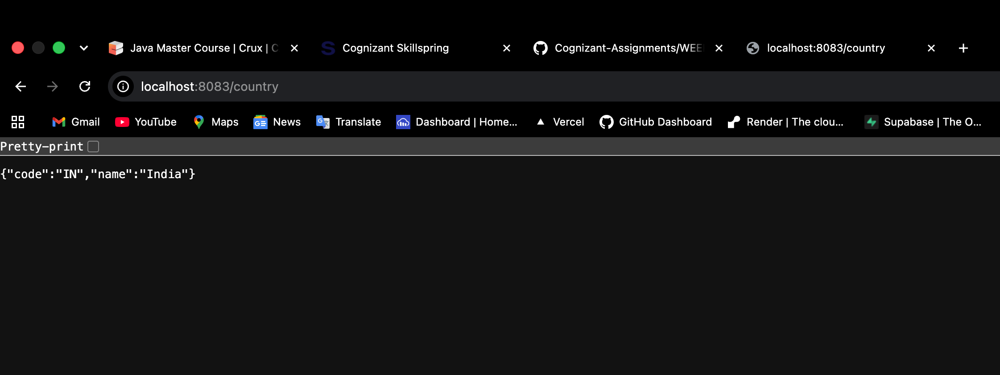

# REST Country Web Service

A RESTful web service built with **Spring Boot** that retrieves and returns details of a country. The application demonstrates how to load a Spring Bean configured via an XML file using the Spring Application Context, and expose it through a REST endpoint.

---

## 🎯 Objective
The primary objective of this application is to:
1. Define a `Country` bean configuration in a Spring XML file (`country.xml`).
2. Load the bean dynamically using the Spring `ApplicationContext` inside a service layer.
3. Expose a REST endpoint to serve the retrieved country details as a JSON response.

---

## 🛠️ Technologies Used
- **Java 17** - Core programming language
- **Spring Boot 3.x / 2.x** - Application framework
- **Spring Web** - For building RESTful endpoints
- **Spring Context** - For managing application beans via XML configuration
- **Maven** - Dependency management and build tool

---

## 📂 Project Structure

```text
src
 ├── main
 │   ├── java
 │   │    └── com.cognizant.springlearn
 │   │           ├── controller
 │   │           │      └── CountryController.java
 │   │           ├── model
 │   │           │      └── Country.java
 │   │           ├── service
 │   │           │      └── CountryService.java
 │   │           └── RestCountryWebServiceApplication.java
 │   └── resources
 │          ├── application.properties
 │          └── country.xml
 └── test
```

---

## ⚙️ Configuration & Code Details

### 1. XML Bean Configuration (`country.xml`)
The country details are declared as a Spring Bean within `src/main/resources/country.xml`:
```xml
<?xml version="1.0" encoding="UTF-8"?>
<beans xmlns="http://www.springframework.org/schema/beans"
       xmlns:xsi="http://www.w3.org/2001/XMLSchema-instance"
       xsi:schemaLocation="
           http://www.springframework.org/schema/beans
           https://www.springframework.org/schema/beans/spring-beans.xsd">

    <bean id="country" class="com.cognizant.springlearn.model.Country">
        <property name="code" value="IN"/>
        <property name="name" value="India"/>
    </bean>

</beans>
```

### 2. Country Service (`CountryService.java`)
Loads the XML-configured bean using `ClassPathXmlApplicationContext`:
```java
@Service
public class CountryService {

    public Country getCountry() {
        ApplicationContext context = new ClassPathXmlApplicationContext("country.xml");
        return (Country) context.getBean("country");
    }
}
```

### 3. Country Controller (`CountryController.java`)
Exposes the endpoint to return the `Country` object:
```java
@RestController
public class CountryController {

    @Autowired
    private CountryService countryService;

    @GetMapping("/country")
    public Country getCountry() {
        return countryService.getCountry();
    }
}
```

---

## 🚀 API Endpoint Reference

| Method | Endpoint | Description | Expected Status |
|:---|:---|:---|:---|
| **GET** | `/country` | Retrieves the details of the configured country. | `200 OK` |

### Sample Request
```bash
curl -X GET http://localhost:8083/country
```

### Expected JSON Response
```json
{
  "code": "IN",
  "name": "India"
}
```

---

## ⚙️ Application Properties
The server is configured to run on port `8083` via `src/main/resources/application.properties`:
```properties
server.port=8083
```

---

## 🏃 How to Run the Application

### Prerequisites
- JDK 17 or higher
- Maven 3.x

### Steps to Run
1. **Clone the repository** and navigate to the project directory:
   ```bash
   cd REST_Country_Web_Service
   ```
2. **Build the project** using Maven:
   ```bash
   mvn clean install
   ```
3. **Run the application**:
   ```bash
   mvn spring-boot:run
   ```
4. **Access the service**:
   Open your browser or an API client (like Postman) and navigate to `http://localhost:8083/country`.

---

## 📸 Output & Verification

### Application Logs
When successfully running, you should see the Spring Boot startup logs similar to the following:


### API Output (Browser / Client)
The response containing country details as loaded from the XML configuration:

