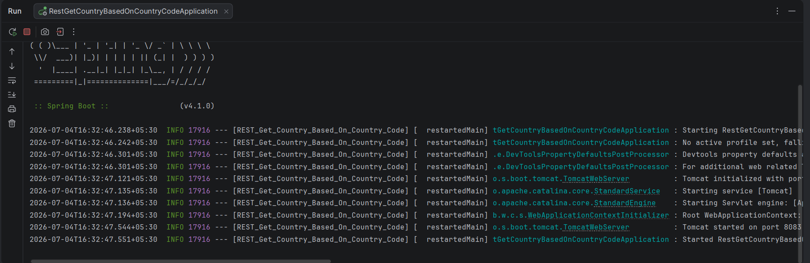
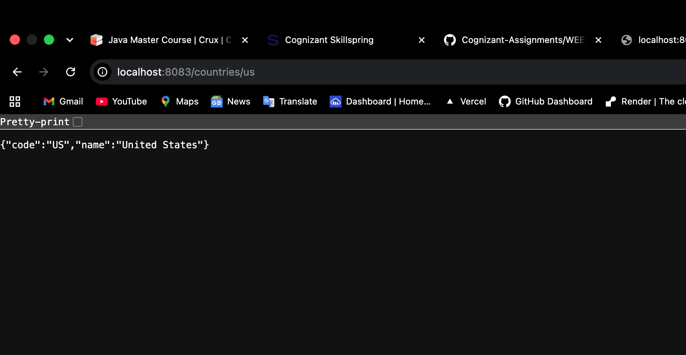

# REST Get Country Based on Country Code

A RESTful web service built with **Spring Boot** that retrieves and returns country details dynamically based on a country code parameter provided in the API request path.

---

## 🎯 Objective
The primary objective of this application is to:
1. Define a `Country` model class.
2. Implement a service layer (`CountryService`) containing a hardcoded list of country objects.
3. Expose a REST endpoint that accepts a country code as a path variable (`/countries/{code}`).
4. Perform a case-insensitive search matching the path variable against the country list, returning the matched `Country` object as a JSON response.

---

## 🛠️ Technologies Used
- **Java 17** - Core programming language
- **Spring Boot 3.x / 2.x** - Application framework
- **Spring Web** - For building RESTful endpoints
- **Maven** - Dependency management and build tool

---

## 📂 Project Structure

```text
src
 ├── main
 │   ├── java
 │   │    └── com.cognizant.springlearn
 │   │           ├── controller
 │   │           │      └── CountryController.java
 │   │           ├── model
 │   │           │      └── Country.java
 │   │           ├── service
 │   │           │      └── CountryService.java
 │   │           └── RestGetCountryBasedOnCountryCodeApplication.java
 │   └── resources
 │          └── application.properties
 └── test
```

---

## ⚙️ Configuration & Code Details

### 1. Country Service (`CountryService.java`)
Maintains a list of countries and implements a case-insensitive search:
```java
@Service
public class CountryService {

    private static List<Country> countryList = new ArrayList<>();

    static {
        countryList.add(new Country("IN", "India"));
        countryList.add(new Country("US", "United States"));
        countryList.add(new Country("JP", "Japan"));
        countryList.add(new Country("DE", "Germany"));
    }

    public Country getCountry(String code) {
        for (Country country : countryList) {
            if (country.getCode().equalsIgnoreCase(code)) {
                return country;
            }
        }
        return null;
    }
}
```

### 2. Country Controller (`CountryController.java`)
Defines the REST controller mapping a GET request with a path parameter:
```java
@RestController
public class CountryController {

    @Autowired
    private CountryService countryService;

    @GetMapping("/countries/{code}")
    public Country getCountry(@PathVariable String code) {
        return countryService.getCountry(code);
    }
}
```

---

## 🚀 API Endpoint Reference

| Method | Endpoint | Path Variable | Description | Expected Status |
|:---|:---|:---|:---|:---|
| **GET** | `/countries/{code}` | `code` (e.g., `in`, `us`) | Returns the matching Country object | `200 OK` |

### Sample Requests & Expected Responses

#### 1. Request for India (`in`)
```bash
curl -X GET http://localhost:8083/countries/in
```
**Response:**
```json
{
  "code": "IN",
  "name": "India"
}
```

#### 2. Request for United States (`us`)
```bash
curl -X GET http://localhost:8083/countries/us
```
**Response:**
```json
{
  "code": "US",
  "name": "United States"
}
```

---

## ⚙️ Application Configuration
The server is configured to run on port `8083` via `src/main/resources/application.properties`:
```properties
server.port=8083
```

---

## 🏃 How to Run the Application

### Prerequisites
- JDK 17 or higher
- Maven 3.x

### Steps to Run
1. **Clone the repository** and navigate to the project directory:
   ```bash
   cd REST_Get_Country_Based_On_Country_Code
   ```
2. **Build the project** using Maven:
   ```bash
   mvn clean install
   ```
3. **Run the application**:
   ```bash
   mvn spring-boot:run
   ```
4. **Access the service**:
   Open your browser or an API client (like Postman) and navigate to:
   - `http://localhost:8083/countries/in`
   - `http://localhost:8083/countries/us`

---

## 📸 Output & Verification

### Application Logs
When successfully running, you should see the Spring Boot startup logs similar to the following:


### API Output (Browser / Client)
The response containing country details matching the code provided in the path:

