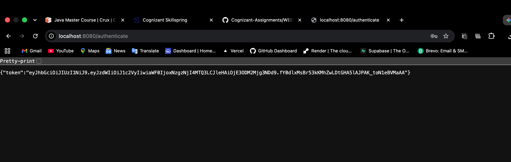

# Create Authentication Service That Returns JWT

A RESTful web service built with **Spring Boot** and **Spring Security** that authenticates users via HTTP Basic Authentication and returns a signed JSON Web Token (JWT).

---

## 🎯 Objective
The primary objective of this application is to:
1. Secure the endpoints using **Spring Security** with In-Memory User Authentication.
2. Allow clients to submit credentials via standard HTTP Basic Authentication headers.
3. Expose a `/authenticate` endpoint that parses the `Authorization` header, decodes the credentials, and issues a JWT token valid for 10 minutes.

---

## 🛠️ Technologies & Dependencies
- **Java 17** - Core programming language
- **Spring Boot 3.x / 4.x** - Application framework
- **Spring Security** - Authentication and endpoint authorization
- **Spring Web** - For building RESTful endpoints
- **JJWT (Java JWT - 0.9.0)** - JSON Web Token library
- **JAXB API & Runtime** - Included for XML binding compatibility with Java 17
- **Maven** - Dependency management and build tool

---

## 📂 Project Structure

```text
src
 └── main
     ├── java
     │   └── com.cognizant.springlearn
     │        ├── controller
     │        │      └── AuthenticationController.java
     │        ├── security
     │        │      └── SecurityConfig.java
     │        └── CreateAuthenticationServiceThatReturnsJwtApplication.java
     │
     └── resources
          └── application.properties
```

---

## ⚙️ Configuration & Code Details

### 1. Spring Security Configuration (`SecurityConfig.java`)
Configures HTTP Basic Authentication, disables CSRF, secures all endpoints, and defines in-memory users with encoded passwords.
```java
@Configuration
public class SecurityConfig {

    @Bean
    PasswordEncoder passwordEncoder() {
        return new BCryptPasswordEncoder();
    }

    @Bean
    InMemoryUserDetailsManager users() {
        UserDetails admin = User.builder()
                .username("admin")
                .password(passwordEncoder().encode("pwd"))
                .roles("ADMIN")
                .build();

        UserDetails user = User.builder()
                .username("user")
                .password(passwordEncoder().encode("pwd"))
                .roles("USER")
                .build();

        return new InMemoryUserDetailsManager(admin, user);
    }

    @Bean
    SecurityFilterChain filterChain(HttpSecurity http) throws Exception {
        http
                .csrf(csrf -> csrf.disable())
                .authorizeHttpRequests(auth -> auth
                        .requestMatchers("/authenticate").authenticated()
                        .anyRequest().authenticated()
                )
                .httpBasic(Customizer.withDefaults());

        return http.build();
    }
}
```

### 2. JWT Generation Controller (`AuthenticationController.java`)
Extracts the `Authorization` header, decodes the username/password base64 credentials, and generates a JWT signed with a secret key:
```java
@RestController
public class AuthenticationController {

    @GetMapping("/authenticate")
    public Map<String, String> authenticate(
            @RequestHeader("Authorization") String authHeader) {

        // Remove "Basic "
        String base64Credentials = authHeader.substring(6);

        // Decode username:password
        byte[] decodedBytes = Base64.getDecoder().decode(base64Credentials);
        String credentials = new String(decodedBytes, StandardCharsets.UTF_8);

        // Extract username
        String username = credentials.split(":")[0];

        // Generate JWT
        String token = Jwts.builder()
                .setSubject(username)
                .setIssuedAt(new Date())
                .setExpiration(new Date(System.currentTimeMillis() + 600000)) // 10 Minutes validity
                .signWith(SignatureAlgorithm.HS256, "secretkey")
                .compact();

        Map<String, String> response = new HashMap<>();
        response.put("token", token);

        return response;
    }
}
```

---

## 🚀 API Endpoint Reference

| Method | Endpoint | Authentication | Description | Expected Status |
|:---|:---|:---|:---|:---|
| **GET** | `/authenticate` | HTTP Basic Auth | Authenticates a user and returns a signed JWT | `200 OK` or `401 Unauthorized` |

### Sample Credentials
- **Username:** `user`
- **Password:** `pwd`

---

## 🏃 How to Run the Application

### Prerequisites
- JDK 17 or higher
- Maven 3.x

### Steps to Run
1. Navigate to the project directory:
   ```bash
   cd Create_Authentication_Service_That_Returns_JWT
   ```
2. Build the project:
   ```bash
   mvn clean install
   ```
3. Run the application:
   ```bash
   mvn spring-boot:run
   ```

---

## 🧪 Testing and Verification

### 1. Test using Curl
Use the following `curl` command with HTTP Basic Authentication credentials:
```bash
curl -u user:pwd -X GET http://localhost:8080/authenticate
```

### 2. Expected JSON Response
```json
{
  "token": "eyJhbGciOiJIUzI1NiJ9.eyJzdWIiOiJ1c2VyIiwiaWF0IjoxNzEzNDU2Nzg5LCJleHAiOiIxNzEzNDU3Mzg5In0.xxxxxxxxx"
}
```

---

## 📸 Output Screenshot
When the authentication is successful, you will receive a JWT token payload:


