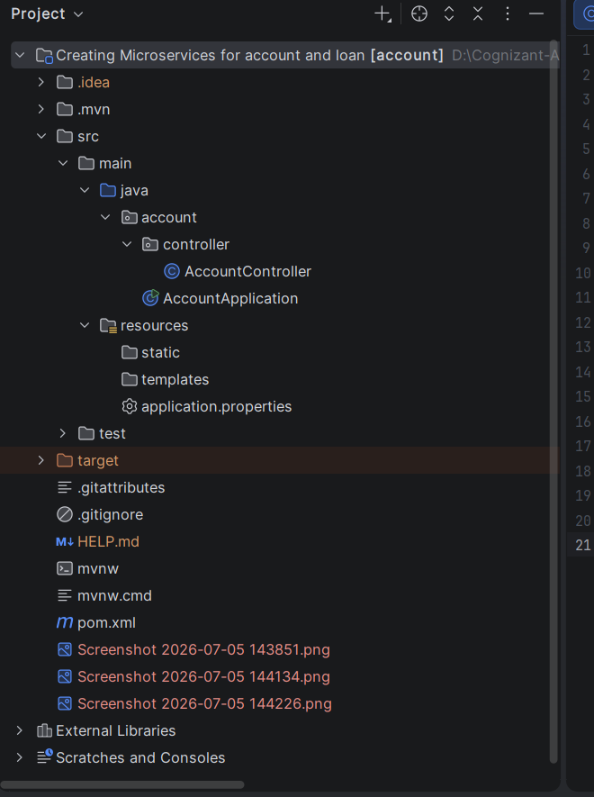
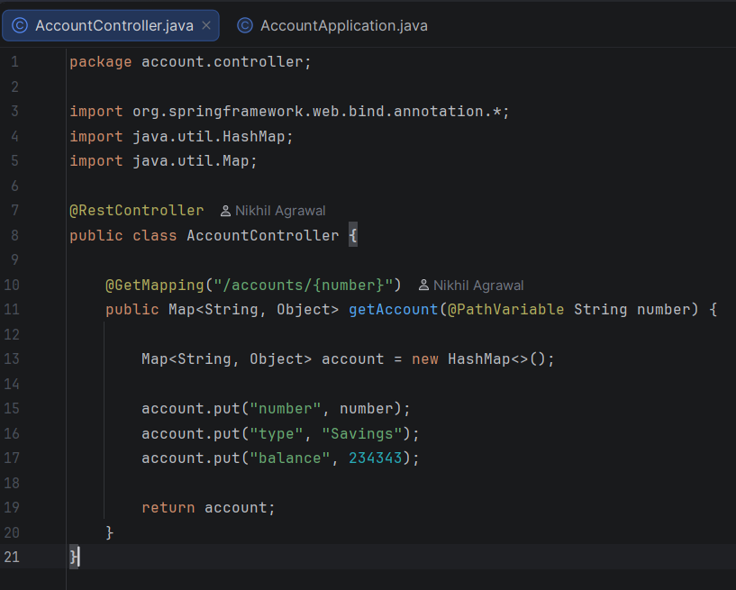
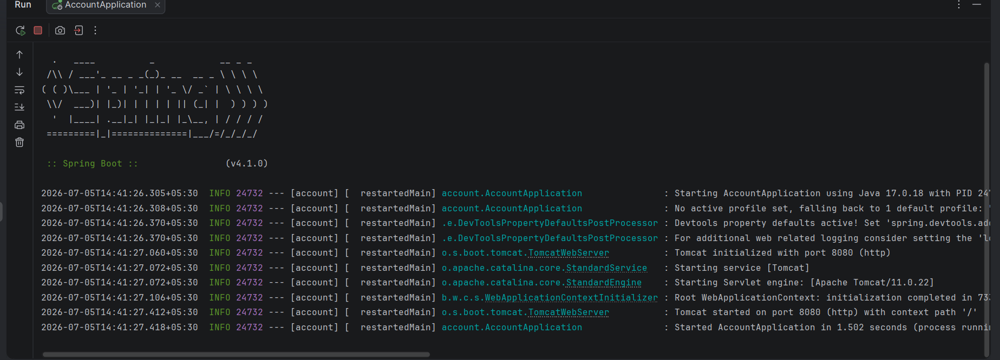
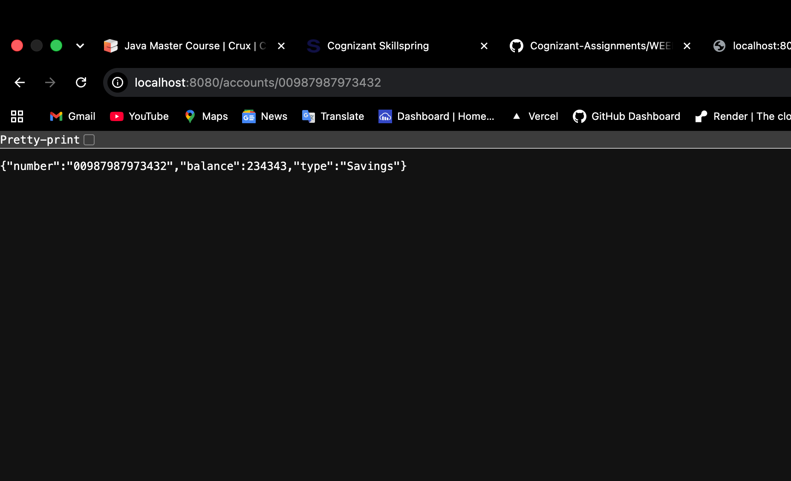

# Account Microservice

A Spring Boot-based microservice that provides account details (such as account number, account type, and balance) for a given account number.

---

## 🎯 Objective
The primary objective of this microservice is to:
1. Expose a RESTful GET endpoint (`/accounts/{number}`) to fetch details for a specific bank account.
2. Return details of the account including the Account Number, Account Type, and Balance in JSON format.
3. Serve as a core microservice within a multi-service banking domain (paired with the Loan Microservice).

---

## 🛠️ Technologies Used
- **Java 17** - Core programming language
- **Spring Boot 4.x / 3.x** - Microservices framework
- **Spring Web** - For building RESTful endpoints
- **Maven** - Project build and dependency management

---

## 📂 Project Structure

```text
account
│── src
│   ├── main
│   │   ├── java
│   │   │   └── account
│   │   │       ├── AccountApplication.java
│   │   │       └── controller
│   │   │           └── AccountController.java
│   │   └── resources
│   │       └── application.properties
│   └── test
│
├── pom.xml
└── readme.md
```

---

## ⚙️ Code Implementation Details

### 1. Main Entrypoint (`AccountApplication.java`)
The initialization class for the Spring Boot application:
```java
package account;

import org.springframework.boot.SpringApplication;
import org.springframework.boot.autoconfigure.SpringBootApplication;

@SpringBootApplication
public class AccountApplication {

	public static void main(String[] args) {
		SpringApplication.run(AccountApplication.class, args);
	}
}
```

### 2. Account Controller (`AccountController.java`)
Exposes the GET endpoint and returns mock account details dynamically mapping the provided account number path parameter:
```java
package account.controller;

import org.springframework.web.bind.annotation.*;
import java.util.HashMap;
import java.util.Map;

@RestController
public class AccountController {

    @GetMapping("/accounts/{number}")
    public Map<String, Object> getAccount(@PathVariable String number) {
        Map<String, Object> account = new HashMap<>();
        account.put("number", number);
        account.put("type", "Savings");
        account.put("balance", 234343);
        return account;
    }
}
```

---

## 🚀 API Endpoint Reference

| Method | Endpoint | Path Parameter | Description | Expected Status |
|:---|:---|:---|:---|:---|
| **GET** | `/accounts/{number}` | `number` (e.g., `00987987973432`) | Retrieves account details by account number | `200 OK` |

### Sample Request
```bash
curl -X GET http://localhost:8080/accounts/00987987973432
```

### Expected JSON Response
```json
{
  "number": "00987987973432",
  "type": "Savings",
  "balance": 234343
}
```

---

## 🏃 How to Run the Application

### Prerequisites
- JDK 17 or higher
- Maven 3.x

### Steps to Run
1. Navigate to the `account` microservice directory:
   ```bash
   cd Creating\ Microservices\ for\ account\ and\ loan/account
   ```
2. Build the microservice:
   ```bash
   mvn clean install
   ```
3. Run the microservice:
   ```bash
   mvn spring-boot:run
   ```
4. Access the REST endpoint in your browser or Postman at:
   `http://localhost:8080/accounts/00987987973432`

---

## 📸 Output & Verification Screenshots

### 1. Project Structure in IDE


### 2. AccountController Code File


### 3. Application Console Output (Running Server)


### 4. Browser Output Response

