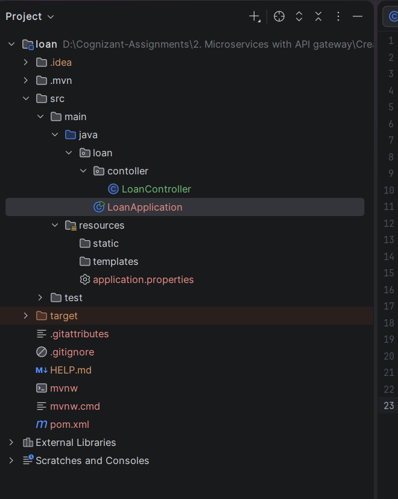
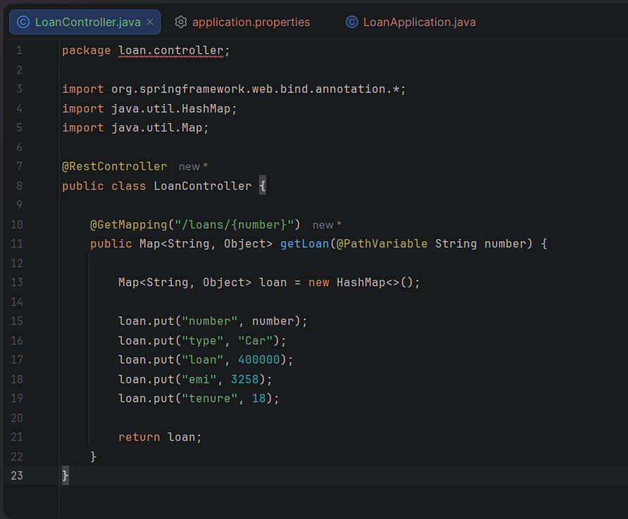
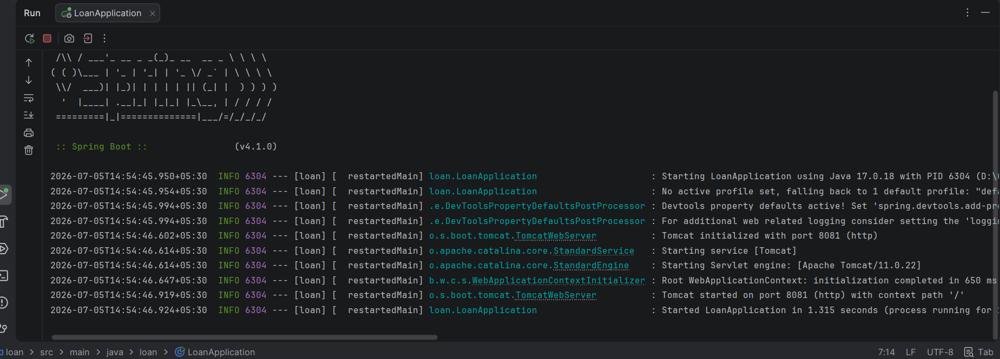
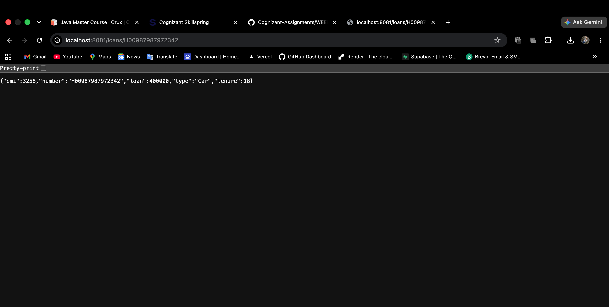

# Loan Microservice

A Spring Boot-based microservice that provides loan details (such as loan number, loan type, principal amount, EMI, and tenure) based on the loan number.

---

## 🎯 Objective
The primary objective of this microservice is to:
1. Expose a RESTful GET endpoint (`/loans/{number}`) to fetch details for a specific loan.
2. Return details of the loan including the Loan Number, Loan Type, Total Loan Amount, EMI, and Tenure in JSON format.
3. Serve as a core microservice within a multi-service banking domain (paired with the Account Microservice).

---

## 🛠️ Technologies Used
- **Java 17** - Core programming language
- **Spring Boot 4.x / 3.x** - Microservices framework
- **Spring Web** - For building RESTful endpoints
- **Maven** - Project build and dependency management

---

## 📂 Project Structure

```text
loan
│── src
│   ├── main
│   │   ├── java
│   │   │   └── loan
│   │   │       ├── LoanApplication.java
│   │   │       └── contoller (Loan Controller Directory)
│   │   │           └── LoanController.java
│   │   └── resources
│   │       └── application.properties
│   └── test
│
├── pom.xml
└── readme.md
```

---

## ⚙️ Code Implementation Details

### 1. Main Entrypoint (`LoanApplication.java`)
The initialization class for the Spring Boot application:
```java
package loan;

import org.springframework.boot.SpringApplication;
import org.springframework.boot.autoconfigure.SpringBootApplication;

@SpringBootApplication
public class LoanApplication {

	public static void main(String[] args) {
		SpringApplication.run(LoanApplication.class, args);
	}
}
```

### 2. Loan Controller (`LoanController.java`)
Exposes the GET endpoint and returns mock loan details dynamically mapping the provided loan number path parameter:
```java
package loan.controller;

import org.springframework.web.bind.annotation.*;
import java.util.HashMap;
import java.util.Map;

@RestController
public class LoanController {

    @GetMapping("/loans/{number}")
    public Map<String, Object> getLoan(@PathVariable String number) {
        Map<String, Object> loan = new HashMap<>();
        loan.put("number", number);
        loan.put("type", "Car");
        loan.put("loan", 400000);
        loan.put("emi", 3258);
        loan.put("tenure", 18);
        return loan;
    }
}
```

---

## 🚀 API Endpoint Reference

| Method | Endpoint | Path Parameter | Description | Expected Status |
|:---|:---|:---|:---|:---|
| **GET** | `/loans/{number}` | `number` (e.g., `H00987987972342`) | Retrieves loan details by loan number | `200 OK` |

### Sample Request
```bash
curl -X GET http://localhost:8081/loans/H00987987972342
```

### Expected JSON Response
```json
{
  "number": "H00987987972342",
  "type": "Car",
  "loan": 400000,
  "emi": 3258,
  "tenure": 18
}
```

---

## ⚙️ Application Configuration
The server is configured to run on port `8081` via `src/main/resources/application.properties`:
```properties
server.port=8081
```

---

## 🏃 How to Run the Application

### Prerequisites
- JDK 17 or higher
- Maven 3.x

### Steps to Run
1. Navigate to the `loan` microservice directory:
   ```bash
   cd Creating\ Microservices\ for\ account\ and\ loan/loan
   ```
2. Build the microservice:
   ```bash
   mvn clean install
   ```
3. Run the microservice:
   ```bash
   mvn spring-boot:run
   ```
4. Access the REST endpoint in your browser or Postman at:
   `http://localhost:8081/loans/H00987987972342`

---

## 📸 Output & Verification Screenshots

### 1. Project Structure in IDE


### 2. LoanController Code File


### 3. Application Console Output (Running Server)


### 4. Browser Output Response

