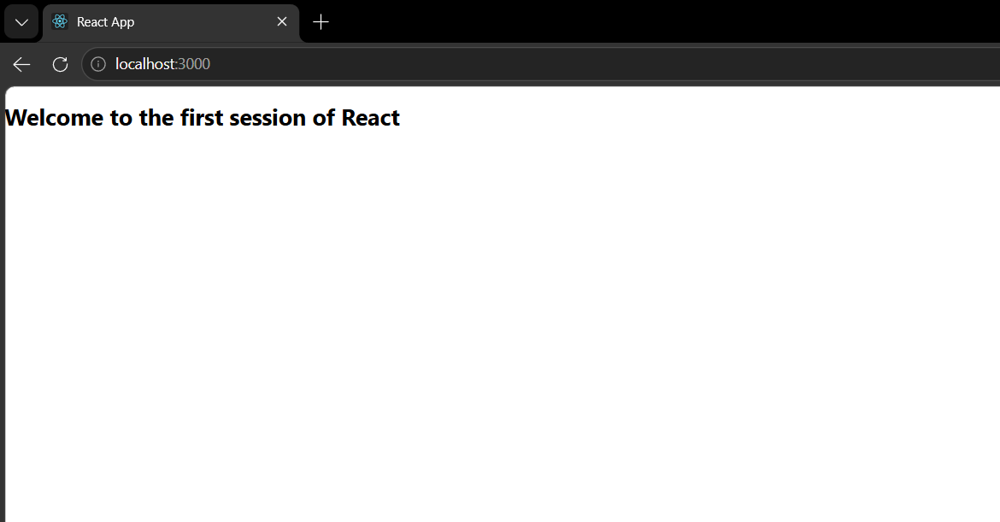

# My First React Application

A simple React application that serves as an introduction to **ReactJS** development. The application displays a welcome message and illustrates the foundational structure of a React project.

---

## 🎯 Objective
Create a basic React application named `myfirstreact` that renders the following message on the home screen:
> **Welcome to the first session of React**

---

## 📖 Key Concepts & Theory

### 1. Single Page Application (SPA)
A **Single Page Application (SPA)** is a web application that loads a single HTML document and dynamically updates the view as the user interacts with the app. Instead of requesting a brand-new page from the server on every click, it fetches only the necessary data (often via REST APIs) and updates the interface on the client side.

#### Benefits of SPAs:
- **Optimized Speed:** Faster page load speeds after the initial load.
- **Fluid User Experience:** Transitions feel like a native desktop/mobile application with no blank-screen refreshes.
- **Reduced Traffic:** Fewer HTML transfers over the wire since only raw JSON/XML data is retrieved.
- **Client-Server Decoupling:** Simplifies APIs since the frontend is a separate concern from backend service endpoints.

---

### 2. Difference Between SPA and MPA

| Feature | Single Page Application (SPA) | Multi-Page Application (MPA) |
|:---|:---|:---|
| **Core Architecture** | Loads a single page; updates DOM dynamically | Loads a new HTML page on every navigation request |
| **Page Reloads** | None | Yes, every action reloads the page |
| **Performance** | Extremely fast (after initial assets load) | Can be slower due to complete layout transfers |
| **User Experience** | Fluid, smooth transitions | Traditional page-loading transitions |
| **Bandwidth Usage** | Low (only data payloads are exchanged) | High (complete page layouts sent on each load) |
| **SEO friendliness** | Requires client-side rendering (CSR) optimization | Search engine crawlable out-of-the-box |
| **Examples** | Gmail, Facebook, Trello | Amazon, typical blogs, online banking systems |

---

### 3. ReactJS
React is a popular declarative, component-based, open-source JavaScript library developed by **Meta (Facebook)** for building high-performance user interfaces.

#### Core Features of React:
- **Component-Based Architecture:** Encourages building modular, self-contained UI blocks that manage their own state.
- **Virtual DOM:** Maintains a lightweight in-memory representation of the DOM. React calculates the difference (diffing) between the state changes and applies only the minimum necessary changes to the real browser DOM.
- **JSX (JavaScript XML):** A syntax extension allowing developers to write HTML-like structures directly inside JavaScript.
- **One-Way Data Binding:** Ensures data flows in a single direction, making code simpler to debug and reason about.

---

## 🛠️ Technologies Used
- **ReactJS 19.x** - Core frontend UI library
- **Node.js & npm** - Runtime environment and package manager
- **HTML5 & CSS3** - Document structure and design styling
- **Create React App (react-scripts)** - Build toolchain configuration

---

## 📂 Project Structure

```text
myfirstreact
├── public
│   ├── index.html       # The single entrypoint page
│   └── ...
├── src
│   ├── App.css          # Stylesheets for the main App component
│   ├── App.js           # Core component displaying the welcome message
│   ├── index.css        # Global CSS rules
│   ├── index.js         # Entrypoint mapping the React app onto index.html
│   └── ...
├── package.json         # Project metadata and dependencies
└── README.md
```

---

## 💻 Code Implementation

### App Component (`src/App.js`)
A minimal functional component that renders the welcome message inside an `<h1>` tag:
```javascript
function App() {
  return (
    <h1>Welcome to the first session of React</h1>
  );
}

export default App;
```

### Entrypoint File (`src/index.js`)
Binds the `App` component into the root DOM node defined in `public/index.html`:
```javascript
import React from 'react';
import ReactDOM from 'react-dom/client';
import './index.css';
import App from './App';

const root = ReactDOM.createRoot(document.getElementById('root'));
root.render(
  <React.StrictMode>
    <App />
  </React.StrictMode>
);
```

---

## 🏃 How to Run the Application

### Prerequisites
Make sure you have [Node.js](https://nodejs.org/) (which includes `npm`) installed.

### Execution Steps
1. Navigate to the project root:
   ```bash
   cd myfirstreact
   ```
2. Install the project dependencies:
   ```bash
   npm install
   ```
3. Start the local development server:
   ```bash
   npm start
   ```
4. Open the application:
   The command should automatically open a browser window pointing to `http://localhost:3000`.

---

## 📸 Output Verification

### Browser Output
When successfully running, you should see the greeting heading rendered on the screen:


