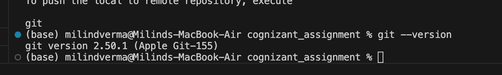
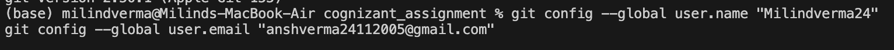
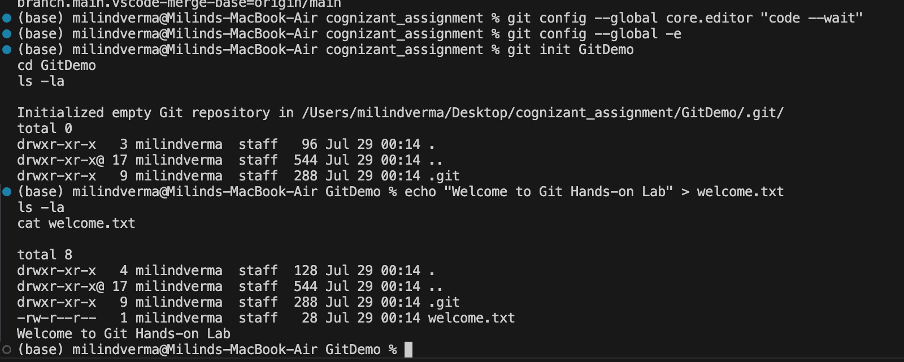
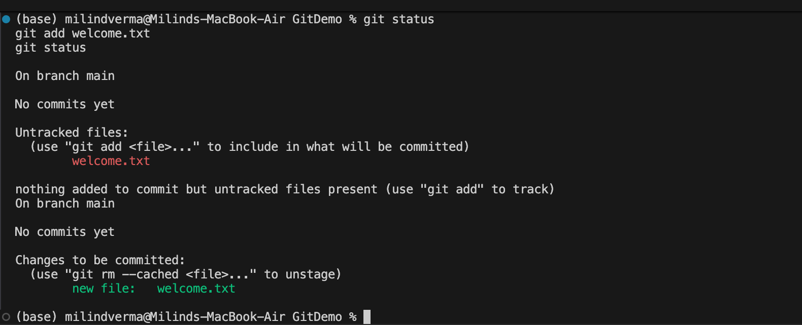

# Week 7: Git Hands-on Lab (macOS Version)

This lab report documents the setup, configuration, and basic operations of Git on macOS, adapting the Windows-specific (Notepad++ / Control Panel) steps to standard macOS workflows using Visual Studio Code and Terminal.

---

## Step 1: Setup Your Machine with Git Configuration

### 1.1 Verify Git Installation
Open your macOS Terminal and run:
```bash
git --version
```
**Example Output:**
```
git version 2.50.1 (Apple Git-155)
```


---

### 1.2 Configure User Credentials
Configure your global git username and email address:
```bash
git config --global user.name "Milindverma24"
git config --global user.email "anshverma24112005@gmail.com"
```

---

### 1.3 Verify Git Configuration
List all configured settings to verify the credentials have been set properly:
```bash
git config --list
```
**Example Output:**
```
user.name=Milindverma24
user.email=anshverma24112005@gmail.com
...
```

---

## Step 2: Configure default editor to VS Code (macOS Notepad++ Adaptation)

Since Notepad++ is a Windows-only editor, we configure Git to use **Visual Studio Code** (`code`) as the default editor. 

### 2.1 Set VS Code as the Default Git Editor
Run the following command:
```bash
git config --global core.editor "code --wait"
```
*(If you prefer to use **nano** instead of VS Code, run: `git config --global core.editor "nano"`)*

---

### 2.2 Verify Default Editor Configuration
Open your global Git configuration file in the default editor:
```bash
git config --global -e
```
This will automatically launch VS Code (or nano) displaying your `.gitconfig` file.


Close the editor window/file to return to the Terminal prompt.

---

## Step 3: Add a File to Source Code Repository

### 3.1 Initialize a New Repository
Create and initialize a new project directory named `GitDemo`:
```bash
git init GitDemo
cd GitDemo
```
**Example Output:**
```
Initialized empty Git repository in /Users/milindverma/Desktop/cognizant_assignment/WEEK_7/GitDemo/.git/
```

Verify hidden files inside the repository directory (including the `.git` directory):
```bash
ls -la
```

---

### 3.2 Create and Verify the Welcome File
Create a new file named `welcome.txt` with some content:
```bash
echo "Welcome to Git Hands-on Lab" > welcome.txt
```

Verify the file has been created:
```bash
ls -la
```

Check the file content in the terminal:
```bash
cat welcome.txt
```
**Example Output:**
```
Welcome to Git Hands-on Lab
```


---

### 3.3 Check Git Status & Track File
Check the status of the repository:
```bash
git status
```
*(You will see `welcome.txt` listed as an **Untracked file** in red).*

Stage the file to track it:
```bash
git add welcome.txt
```

Check the status again:
```bash
git status
```
*(You will see `welcome.txt` listed as a **Change to be committed** in green).*


---

### 3.4 Commit Changes Using Default Editor
Commit the staged file:
```bash
git commit
```
This will open your default editor (VS Code or nano). Add a multi-line commit comment, save the file, and close it.

**Example Multi-Line Comment:**
```
Initial commit of welcome.txt

- Created welcome.txt with welcome message.
- Verified file content and added it to staging.
```

Once you close the editor, the commit will complete:
```
[main (root-commit) a1b2c3d] Initial commit of welcome.txt
 1 file changed, 1 insertion(+)
 create mode 100644 welcome.txt
```

Verify the final status (the working directory is now clean):
```bash
git status
```
**Example Output:**
```
On branch main
nothing to commit, working tree clean
```

---

### 3.5 Pull & Push to Remote Repository (GitLab)
Log into GitLab, create a remote repository named `GitDemo`, and link it:
```bash
git remote add origin https://gitlab.com/Milindverma24/GitDemo.git
```

To pull the remote repository:
```bash
git pull origin main --rebase
```
*(Use `git pull origin master` if your GitLab project's default branch is `master`)*

To push your local repository:
```bash
git push -u origin main
```
*(Use `git push -u origin master` if your branch is `master`)*


