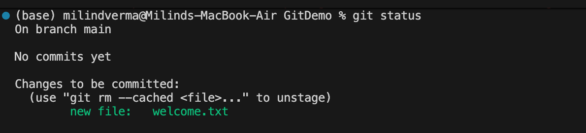
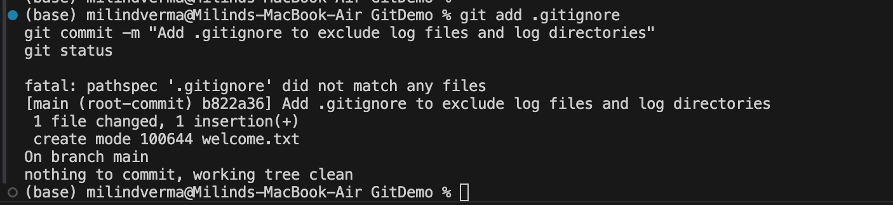

# Week 7: Git Hands-on Lab 2 - Ignoring Files using `.gitignore`

This lab report documents the setup, configuration, and execution of ignoring unwanted files and directories in Git using `.gitignore` on macOS.

---

## Step 1: Create Log Files and Folder (Before Ignoring)

First, navigate to your Git repository (e.g., `GitDemo`) and create temporary log files and a log folder. These are typical examples of files generated during execution that you do not want to track in Git.

### 1.1 Create Files & Folder
Run the following commands in your terminal:
```bash
# Ensure you are in your Git repository directory
cd /Users/milindverma/Desktop/cognizant_assignment/GitDemo

# Create a log file at the root
touch app.log

# Create a log directory and place a log file inside it
mkdir log
touch log/system.log
```

---

### 1.2 Verify Untracked Files Status
Run `git status` to see how Git detects these new files:
```bash
git status
```

**Example Output:**
```
On branch main
Untracked files:
  (use "git add <file>..." to include in what will be committed)
	app.log
	log/
	welcome.txt
```
> *Note: At this stage, Git detects both `app.log` and the `log/` folder as untracked files.*


---

## Step 2: Configure the `.gitignore` File

Now, we will configure `.gitignore` to instruct Git to ignore all `.log` files and the entire `log/` directory.

### 2.1 Create and Edit `.gitignore`
Create a `.gitignore` file in the root of your repository:
```bash
touch .gitignore
```

Open `.gitignore` in your default editor (VS Code or nano):
```bash
code .gitignore
```
*(Or run `nano .gitignore`)*

Add the following rules to the file:
```
# Ignore all log files ending with .log
*.log

# Ignore the log folder and all files inside it
log/
```
Save the file and close the editor.


---

## Step 3: Verify Files Are Successfully Ignored

### 3.1 Check Git Status
Run `git status` to confirm that the `.log` files and the `log/` directory are no longer being tracked or listed:
```bash
git status
```

**Example Output:**
```
On branch main
Untracked files:
  (use "git add <file>..." to include in what will be committed)
	.gitignore
	welcome.txt
```
> *Success! The `app.log` file and the `log/` directory are now completely ignored by Git. Only the `.gitignore` file and your other valid project files (like `welcome.txt`) appear as untracked.*



---

## Step 4: Commit `.gitignore` to the Repository

Finally, stage and commit the `.gitignore` file so that these ignore rules are saved and applied for all future work.

### 4.1 Stage and Commit
```bash
# Stage the .gitignore file
git add .gitignore

# Commit the .gitignore file directly
git commit -m "Add .gitignore to exclude log files and log directories"
```

---

### 4.2 Verify Clean Workspace
Check the status one last time to verify a clean working directory:
```bash
git status
```

**Example Output:**
```
On branch main
nothing to commit, working tree clean
```


