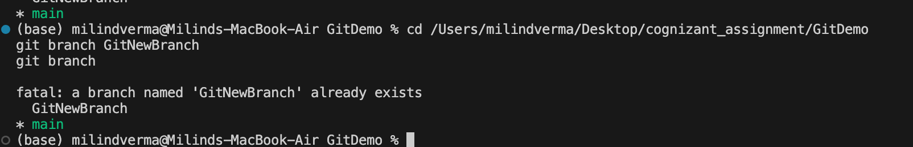
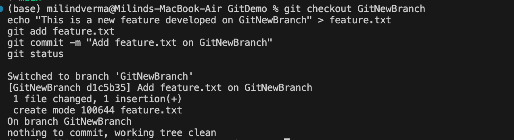
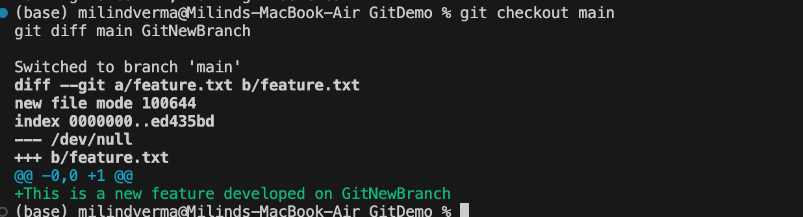
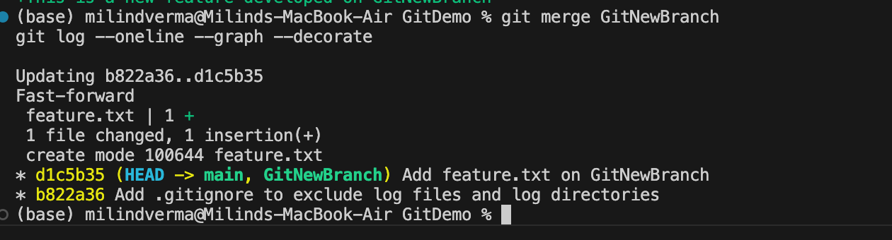
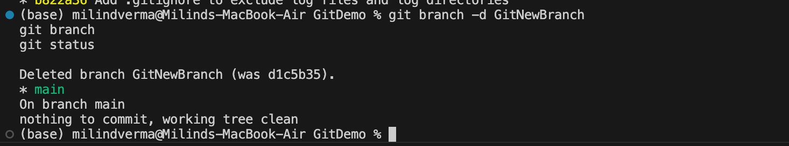

# Week 7: Git Hands-on Lab 3 - Branching and Merging

This hands-on lab documents the setup, execution, and verification of branching, merging, diff checking, and branch deletion on macOS.

---

## Step 1: Branching - Creating and Listing Branches

Branching allows you to isolate development work without affecting the main codebase (`main`/`master` branch).

### 1.1 Navigate to Repository and Create Branch
Navigate to your repository (e.g., `GitDemo`) and create a new branch named `GitNewBranch`:
```bash
cd /Users/milindverma/Desktop/cognizant_assignment/GitDemo
git branch GitNewBranch
```

---

### 1.2 List Local Branches
Verify the branch is created and list all available branches:
```bash
git branch
```
**Example Output:**
```
  GitNewBranch
* main
```
> *Note: The asterisk (`*`) indicates the branch you are currently on (the active branch).*



---

## Step 2: Working in the New Branch

Now we will switch to the new branch, make some changes, and commit them.

### 2.1 Switch to the Branch
```bash
git checkout GitNewBranch
```
*Alternatively, you can use `git switch GitNewBranch`.*

---

### 2.2 Add and Commit a New File
Create a new file `feature.txt` with some content, stage it, and commit the changes:
```bash
echo "This is a new feature developed on GitNewBranch" > feature.txt
git add feature.txt
git commit -m "Add feature.txt on GitNewBranch"
git status
```
**Example Output for Status:**
```
On branch GitNewBranch
nothing to commit, working tree clean
```



---

## Step 3: Comparing Differences

Before merging, it's best practice to review the changes between your branch and the main trunk branch.

### 3.1 Switch Back to Main Trunk
```bash
git checkout main
```

---

### 3.2 List Differences in Terminal
To list the differences between your active branch (`main`) and the target branch (`GitNewBranch`):
```bash
git diff main GitNewBranch
```

---

### 3.3 Visual Difference Check
On macOS, instead of Windows-only P4Merge, you can use Visual Studio Code's built-in diff viewer or standard git diff:
```bash
git diff main GitNewBranch --name-only
```
Or to open it visually in VS Code (if configured):
```bash
git difftool main GitNewBranch
```



---

## Step 4: Merging the Branch

Merging brings the changes from your development branch into the main trunk.

### 4.1 Merge the Branch
Ensure you are on the `main` branch, then merge `GitNewBranch` into it:
```bash
git merge GitNewBranch
```
**Example Output:**
```
Updating b822a36..d4e2f1c
Fast-forward
 feature.txt | 1 +
 1 file changed, 1 insertion(+)
 create mode 100644 feature.txt
```

---

### 4.2 Observe the Graph Log
Check the graphical commit log showing the merges and branches:
```bash
git log --oneline --graph --decorate
```
**Example Output:**
```
* d4e2f1c (HEAD -> main, GitNewBranch) Add feature.txt on GitNewBranch
* b822a36 Add welcome.txt and gitignore
```



---

## Step 5: Deleting the Branch

After a branch is successfully merged, it should be deleted to keep the repository clean.

### 5.1 Delete the Merged Branch
Delete `GitNewBranch` locally:
```bash
git branch -d GitNewBranch
```
**Example Output:**
```
Deleted branch GitNewBranch (was d4e2f1c).
```

---

### 5.2 Verify Status
List the branches and check the final status of the repository:
```bash
git branch
git status
```
**Example Output:**
```
* main
```


