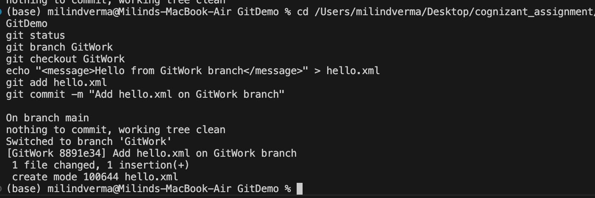
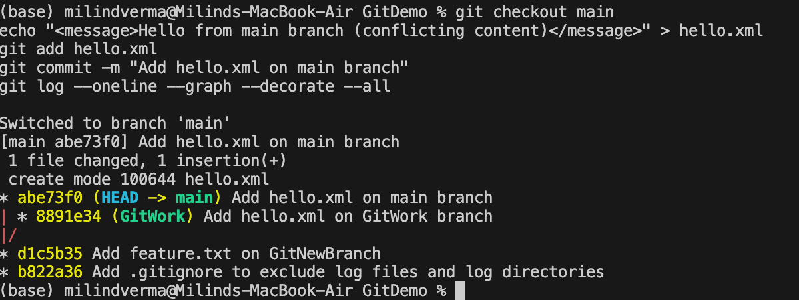
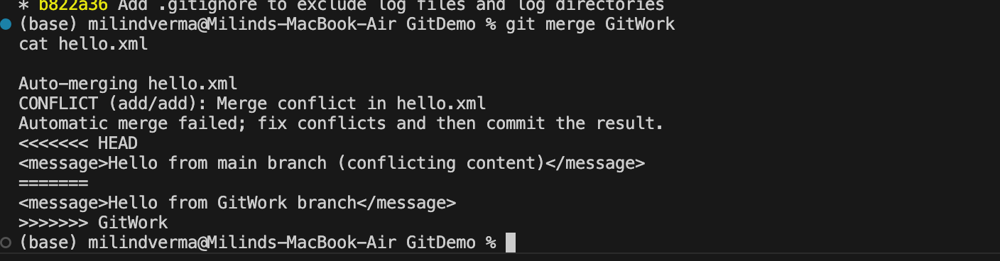
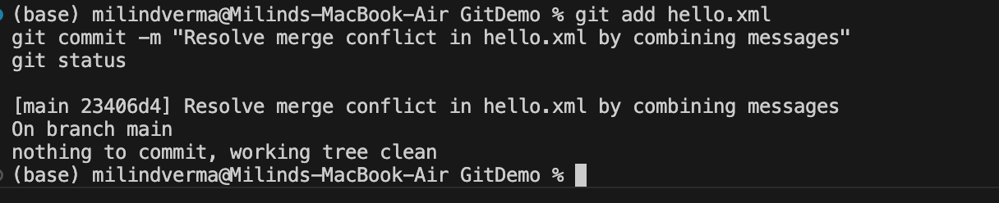
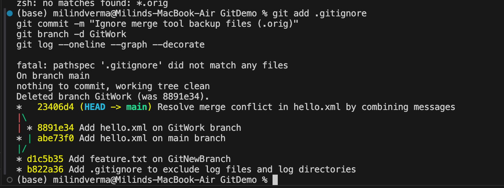

# Week 7: Git Hands-on Lab 4 - Resolving Merge Conflicts

This hands-on lab documents the process of creating and resolving merge conflicts when two different branches modify the same file concurrently on macOS.

---

## Step 1: Create Branch and Modify File

Before we start, verify that the repository is clean.

### 1.1 Verify Clean State and Create Branch
Navigate to the repository, confirm the status is clean, and create a branch named `GitWork`:
```bash
cd /Users/milindverma/Desktop/cognizant_assignment/GitDemo
git status
git branch GitWork
git checkout GitWork
```

---

### 1.2 Add and Commit `hello.xml` on the Branch
Create `hello.xml` with a specific XML structure:
```bash
echo "<message>Hello from GitWork branch</message>" > hello.xml
git add hello.xml
git commit -m "Add hello.xml on GitWork branch"
git status
```
**Example Output:**
```
On branch GitWork
nothing to commit, working tree clean
```



---

## Step 2: Concurrently Modify same file on Main

Now, switch back to the `main` trunk and create a conflicting version of the same file.

### 2.1 Switch to Main and Create a Conflicting `hello.xml`
```bash
git checkout main
echo "<message>Hello from main branch (conflicting content)</message>" > hello.xml
```

---

### 2.2 Commit the conflicting file on Main
```bash
git add hello.xml
git commit -m "Add hello.xml on main branch"
```

---

### 2.3 Observe the Branch Divergence in Logs
View the logs across all branches showing the divergence:
```bash
git log --oneline --graph --decorate --all
```
**Example Output:**
```
* 3f4a5b6 (HEAD -> main) Add hello.xml on main branch
| * d1c5b35 (GitWork) Add hello.xml on GitWork branch
|/  
* a1b2c3d Add .gitignore to exclude log files
```



---

## Step 3: Trigger the Merge Conflict

When you attempt to merge `GitWork` into `main`, Git will fail to merge automatically because the same file has been edited differently in both branches.

### 3.1 Perform the Merge
Ensure you are on the `main` branch, then merge `GitWork`:
```bash
git merge GitWork
```

**Example Output:**
```
Auto-merging hello.xml
CONFLICT (add/add): Merge conflict in hello.xml
Automatic merge failed; fix conflicts and then commit the result.
```

---

### 3.2 View Git Markup (Conflict Markers)
Open `hello.xml` in Terminal to observe the conflict markers:
```bash
cat hello.xml
```
**Output with markers:**
```xml
<<<<<<< HEAD
<message>Hello from main branch (conflicting content)</message>
=======
<message>Hello from GitWork branch</message>
>>>>>>> GitWork
```
> *Explanation of conflict markers:*
> - `<<<<<<< HEAD`: Points to changes on the active branch (`main`).
> - `=======`: Divider between the conflicting changes.
> - `>>>>>>> GitWork`: Points to changes on the merging branch (`GitWork`).



---

## Step 4: Resolve the Conflict

We need to edit the file to select the desired final version, remove the markers, and complete the merge.

### 4.1 Edit and Resolve the File
Open `hello.xml` in VS Code or nano:
```bash
code hello.xml
```
Edit the content to merge the changes (e.g., combining both messages inside a root tag) and remove all conflict markers:
```xml
<messages>
  <message>Hello from main branch (conflicting content)</message>
  <message>Hello from GitWork branch</message>
</messages>
```
Save and close the file.

---

### 4.2 Stage and Commit the Resolution
Stage the resolved file and commit to finalize the merge:
```bash
git add hello.xml
git commit -m "Resolve merge conflict in hello.xml by combining messages"
```
Check the status:
```bash
git status
```
**Example Output:**
```
On branch main
nothing to commit, working tree clean
```



---

## Step 5: Ignore Backup Files & Clean Up

Some merging tools leave backup files (like `.orig` files) in the working directory. We should verify status and ensure backup file patterns are added to `.gitignore`.

### 5.1 Update `.gitignore`
Open `.gitignore` and add the backup pattern:
```bash
code .gitignore
```
Add:
```text
# Ignore merge tool backup files
*.orig
```
Save and close.

---

### 5.2 Commit `.gitignore` and Delete the Branch
Stage, commit, and delete the merged `GitWork` branch:
```bash
git add .gitignore
git commit -m "Ignore merge tool backup files (.orig)"
git branch -d GitWork
```

---

### 5.3 Verify Final Logs
Check the graphical log showing the successfully merged branch history:
```bash
git log --oneline --graph --decorate
```
**Example Output:**
```
*   e7f8g9h (HEAD -> main) Resolve merge conflict in hello.xml by combining messages
|\  
| * d1c5b35 Add hello.xml on GitWork branch
* | 3f4a5b6 Add hello.xml on main branch
|/  
* a1b2c3d Add .gitignore to exclude log files
```


