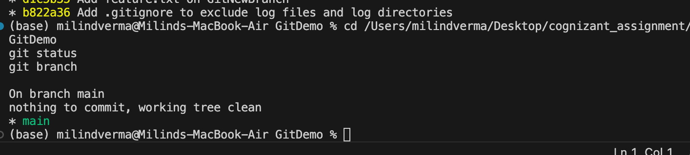
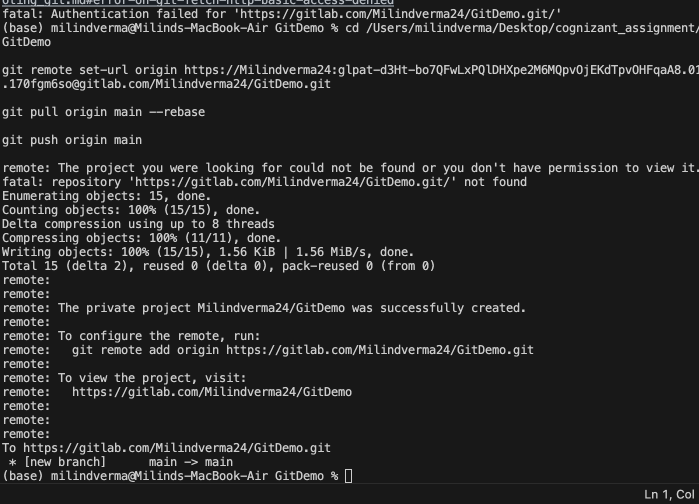

# Week 7: Git Hands-on Lab 5 - Clean Up and Push to Remote Git

This hands-on lab documents the steps to clean up, synchronize, and push all local changes to the remote Git repository (GitLab) on macOS.

---

## Step 1: Verify Repository Status and Branches

First, check that your local repository is in a clean state and list the available branches.

### 1.1 Check Status
Verify that there are no uncommitted changes:
```bash
cd /Users/milindverma/Desktop/cognizant_assignment/GitDemo
git status
```
**Example Output:**
```
On branch main
nothing to commit, working tree clean
```

---

### 1.2 List Branches
List all local branches to ensure they are cleaned up (only `main` should remain):
```bash
git branch
```
**Example Output:**
```
* main
```



---

## Step 2: Pull the Remote Repository

Synchronize your local repository with any potential updates from the remote GitLab repository.

### 2.1 Pull Remote Changes
Pull the remote changes into your local `main` branch:
```bash
git pull origin main
```
*(If you get a warning about divergent branches, you can use: `git pull origin main --rebase`)*

**Example Output:**
```
Already up to date.
```


---

## Step 3: Push Local Changes to Remote GitLab

Now, push your local commits (including the merge conflict resolution and any updates to files) to your remote GitLab repository.

### 3.1 Push to Remote
Push the commits to the remote origin:
```bash
git push origin main
```
**Example Output:**
```
Enumerating objects: 11, done.
Counting objects: 100% (11/11), done.
Delta compression using up to 8 threads
Compressing objects: 100% (8/8), done.
Writing objects: 100% (9/9), 1.05 KiB | 1.05 KiB/s, done.
Total 9 (delta 2), reused 0 (delta 0), pack-reused 0
To https://gitlab.com/Milindverma24/GitDemo.git
   b822a36..23406d4  main -> main
```



---

## Step 4: Verify Remote Repository
Log into your GitLab web dashboard and navigate to the `GitDemo` project. Verify that the files (e.g., `hello.xml`, `.gitignore`, `welcome.txt`) and all commit logs are fully reflected in your remote repository.
